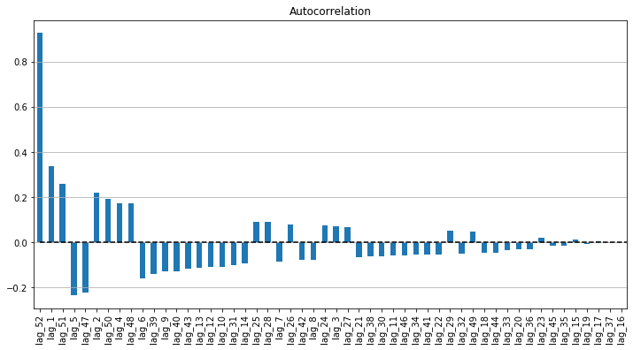
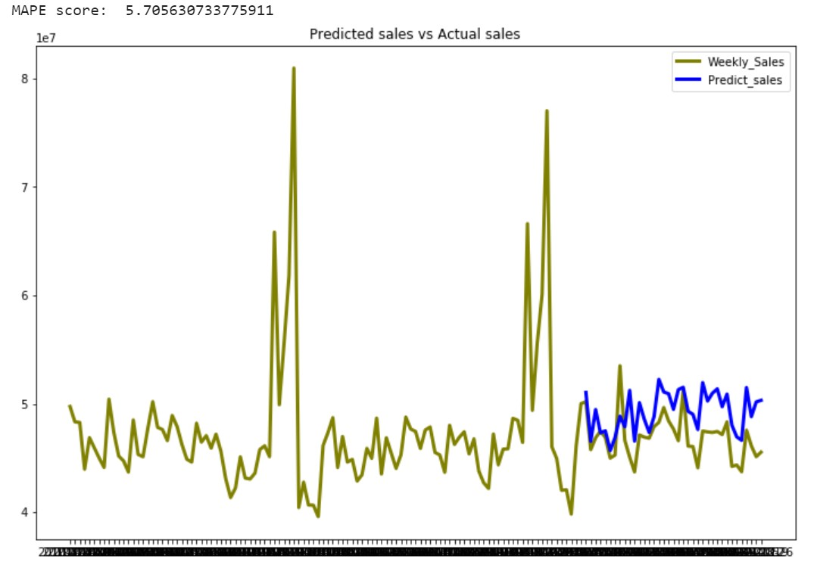
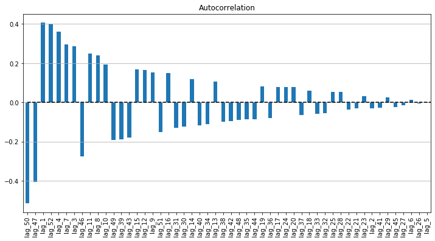
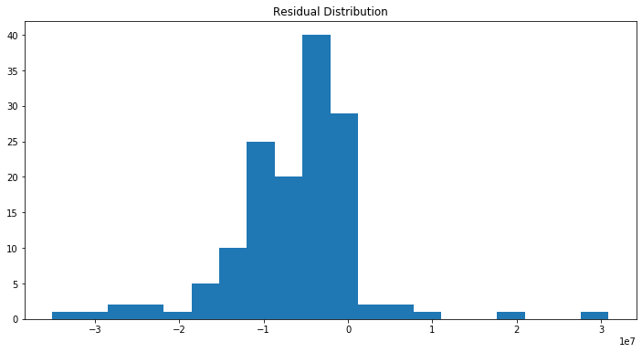
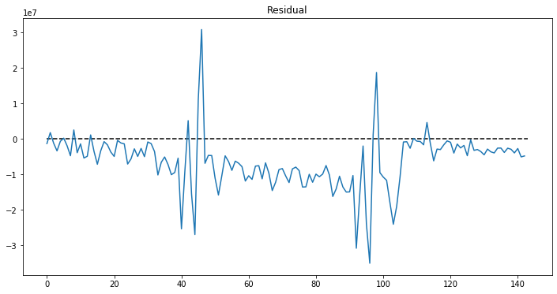

---
authors:
- admin
categories:
- Data Science
- Time Series
- Forecasting
- ARIMA
date: "2020-02-06T00:00:00Z"
draft: false
featured: false
image:
  caption: ''
  focal_point: ""
  placement: 2
  preview_only: false
lastmod: "2020-02-14T00:00:00Z"
projects: []
subtitle: 'Reveal the proper forecasting method with Time series, denote characteristics of the Time series and forecast its future values using Retail sales data as example code'
summary: 'Denote characteristics of the Time series and forecast its future values using Retail sales data as example code'
description: 'Comprehensive understanding on Time Series, Denote characteristics of the Time series and forecast its future values using Retail sales data as example code'
tags:
- Time series
- Forecast
- Retail sales
- ARIMA
title: 'Comprehensive understanding on Time Series forecasting'
---

## 1. What is Time Series

Time series is a sequence of value corresponding with time. Retail sales data, Daily temperature, production, demand, natural reserves are time series data because the later values depend on their historical values.

## 2. What makes up Time Series

There are 4 components in Time Series: Level, Trend, Seasonality and Noise.

*	**Level**: the average value of the time series
*	**Trend**: The movement of the series values from 1 period to another period
*	**Seasonality**: The short-term cyclical behavior of the series that can be observed several times
*	**Noise**: the random variation that results from the measurement of error

It is not always that we will be able to distinguish the first 3 elements from Noise because they are usually invisble which need some techniques to be noticeable

To observe and identify the existence of these components, we can consider.

*	Plot the Time series (this is the best way to detect the characteristics of the series)
*	Zoom in a specify shorter period of time 
* Change scale of the series to observe the trend more clearly
*	Suppress seasonality: aggregate the time series to a bigger time scale (from hourly scale to daily scale, from monthly scale to yearly scale, etc.)

I used 3-year weekly sales of a Retail store as an illustration.

```python
plt.plot("Date", "Weekly_Sales", data=Wal_sales)
plt.hlines(y=Wal_sales.Weekly_Sales.mean(), xmin=0, xmax=len(Wal_sales), linestyles='dashed')
```


With this data, there are obviously 2 peaks which denotes quite a clear **seasonality at the end of year** (probably Christmas and New year period). There might be other sesonality but it is hard to observe it from the plot. **Auto correlation** can be used to confirm the seasonality.

## 3. Autocorrelation

Autocorrelation describes the **connection between the value of time series  and its neighbors**. Thus, to compute Autocorrelation, we calculate the correlation of the series with its **lagged versions**. Lag-n version is produced from the original dataset by moving the series values forward n period. For example, lag-1 is moved forward 1 period, Lag-10 series is moved forward 10 periods. 

By observing the correlation of the series and its lags, we can confirm the seasonality of the series.

```python
auto_cor = sales.groupby("Date")["Weekly_Sales"].sum()
auto_cor = pd.DataFrame(auto_cor)
auto_cor.columns = ["y"]

# Adding the lag of the target variable from 1 steps back up to 52 (due to a seasonality at the end of the year)
for i in range(1, 53):
    auto_cor["lag_{}".format(i)] = auto_cor.y.shift(i)

# Compute autocorrelation of the series and its lags
lag_corr = auto_cor.corr()
lag_corr = lag_corr.iloc[1:,0]
lag_corr.columns = ["corr"]
order = lag_corr.abs().sort_values(ascending = False)
lag_corr = lag_corr[order.index]

# Plot the Autocorrelation
plt.figure(figsize=(12, 6))
lag_corr.plot(kind='bar')
plt.grid(True, axis='y')
plt.title("Autocorrelation")
plt.hlines(y=0, xmin=0, xmax=len(lag_corr), linestyles='dashed')
```



* Judging from the Autocorrelation plot above, there is a strong positive autocorrelation in lag-52 as well as lag-51 as we expected when observing the time series plot. This implies a **cyclical annual pattern at the end of the year**.
* The second strong correlation is lag-1, which connotes as the second week of february, or Valentine period. 
* The autocorrelation reveals both **Positive** and **Negative** autocorrelation, which implies that the series does not move in the same direction but ups and downs.

Autocorrelation can plotted easily through using *autocorrelation_plot* function from *pandas.plotting* in Python or *acf* function from *tseries* package in R.

## 4. Forecasting Time series

There are several methods to forecast Time series.

*	**Model-based method through multiple linear regression** to explore the correlation of the series with other features. Alike other cross-sessional data, model-based method compute the dependence of the time series to other features, but does not take into account the dependence between time series values within different periods.
*	**Data-driven method in which learns the pattern from the data itself** and estimate the next value of the time series in correspondence with its previous values. The data-driven method is important in time series given in the time series context, the values in adjoining period tend to be correlated with each other. Such correlation is denoted as **Autocorrelation**.
*	**Combining method by forecasting the future values of the series as well as the future value of residual that generated from the first forecasting model**, and then combine the result of 2 forecast together. The residual forecast acts as the correct for the first forecast.
*	**Ensembles method** by averaging multiple methods to get the result

### Forecasting using Data-driven method:

ARIMA model is the most frequent choice to compute data-driven forecasting. You can find detail for ARIMA model in this [post](https://geniusnhu.netlify.com/publication/arima-autoregressive-intergreated-moving-average/). 
Here I will apply the ARIMA to the data.

It is useful to use *:auto_arima**function from **pmdarima** in Python or **auto.arima** function from **forecast** packgage in R.

There is one thing to note is that from the Autocorrelation above, there is a clear seasonality at lag 52 so we will need to include this into the ARIMA model.

```python
stepwise_model = pm.auto_arima(Wal_sales.iloc[:,1].values, start_p=1, start_q=1,
                               max_p=20, max_q=20, m=52,
                               start_P=0, seasonal=True,
                               d=1, D=1, trace=True,
                               error_action='ignore',  
                               suppress_warnings=True, 
                               stepwise=True)
print(stepwise_model.aic())
```

*Result*

```
Performing stepwise search to minimize aic
Fit ARIMA: (1, 1, 1)x(0, 1, 1, 52) (constant=True); AIC=nan, BIC=nan, Time=nan seconds
Fit ARIMA: (0, 1, 0)x(0, 1, 0, 52) (constant=True); AIC=2898.191, BIC=2903.190, Time=0.423 seconds
Fit ARIMA: (1, 1, 0)x(1, 1, 0, 52) (constant=True); AIC=2883.839, BIC=2893.839, Time=5.555 seconds
Fit ARIMA: (0, 1, 1)x(0, 1, 1, 52) (constant=True); AIC=nan, BIC=nan, Time=nan seconds
Fit ARIMA: (0, 1, 0)x(0, 1, 0, 52) (constant=False); AIC=2907.540, BIC=2910.039, Time=0.371 seconds
Fit ARIMA: (1, 1, 0)x(0, 1, 0, 52) (constant=True); AIC=2893.265, BIC=2900.764, Time=0.807 seconds
Fit ARIMA: (1, 1, 0)x(2, 1, 0, 52) (constant=True); AIC=nan, BIC=nan, Time=nan seconds
Fit ARIMA: (1, 1, 0)x(1, 1, 1, 52) (constant=True); AIC=nan, BIC=nan, Time=nan seconds
Fit ARIMA: (1, 1, 0)x(0, 1, 1, 52) (constant=True); AIC=nan, BIC=nan, Time=nan seconds
Fit ARIMA: (1, 1, 0)x(2, 1, 1, 52) (constant=True); AIC=nan, BIC=nan, Time=nan seconds
Fit ARIMA: (0, 1, 0)x(1, 1, 0, 52) (constant=True); AIC=2890.759, BIC=2898.258, Time=7.666 seconds
Fit ARIMA: (2, 1, 0)x(1, 1, 0, 52) (constant=True); AIC=2884.464, BIC=2896.963, Time=7.595 seconds
Fit ARIMA: (1, 1, 1)x(1, 1, 0, 52) (constant=True); AIC=2884.895, BIC=2897.394, Time=20.608 seconds
Fit ARIMA: (0, 1, 1)x(1, 1, 0, 52) (constant=True); AIC=2883.040, BIC=2893.039, Time=6.410 seconds
Fit ARIMA: (0, 1, 1)x(0, 1, 0, 52) (constant=True); AIC=2893.770, BIC=2901.269, Time=5.440 seconds
Fit ARIMA: (0, 1, 1)x(2, 1, 0, 52) (constant=True); AIC=nan, BIC=nan, Time=nan seconds
Fit ARIMA: (0, 1, 1)x(1, 1, 1, 52) (constant=True); AIC=nan, BIC=nan, Time=nan seconds
Fit ARIMA: (0, 1, 1)x(2, 1, 1, 52) (constant=True); AIC=nan, BIC=nan, Time=nan seconds
Fit ARIMA: (0, 1, 2)x(1, 1, 0, 52) (constant=True); AIC=2887.816, BIC=2900.315, Time=7.108 seconds
Fit ARIMA: (1, 1, 2)x(1, 1, 0, 52) (constant=True); AIC=2889.929, BIC=2904.928, Time=17.358 seconds
Total fit time: 79.418 seconds
2883.039997060003
```
This fuction chose the lowest AIC-score model and embed it for further model usage.

Split train-test set, train the model and make prediction.

```python
#Split train and test
train = Wal_sales.iloc[:106,1].values
test = Wal_sales.iloc[106:,1].values
# Train the model
stepwise_model.fit(train)

# Predict test set
pred = stepwise_model.predict(n_periods=37)

# Reframe the data
test_pred = Wal_sales.iloc[106:,:2]
test_pred["Predict_sales"] = np.array(pred,dtype="float")

# Visualize the prediction
plt.figure(figsize=(12,8))
plt.plot( 'Date', 'Weekly_Sales', data=Wal_sales, markersize=12, color='olive', linewidth=3)
plt.plot( 'Date', 'Predict_sales', data=test_pred, marker='', color='blue', linewidth=3)
plt.title("Predicted sales vs Actual sales")
plt.legend()

print("MAPE score: ", mean_absolute_percentage_error(test, pred))
```


     
* In overal, the model seem to work moderately on the data but there is still room to improve further.
* The MAPE (mean absolute percentage error) score is 5.7%, which is not too high, not too low.
* The ARIMA model seems to perform well in early predicted value and gets worse in later predicted values.

#### One question emerged, does this model truly capture the values of the time series data?

It is helpful to take a look at the **Residual** of the model (or the **diference between predicted values and actual values**). Examining the residuals of the forecasting model is suggested to evaluate whether the specified model has adequately captured the information of the data. This can be done through exploring the correlation of one period's residual with other periods' ones. 

The Residuals of a **good time series forecasting model** have the following properties:

*	Residuals are **uncorrelated** 
*	Residuals have **zero or nearly-zero mean** (which means the model is unbiased in any directions)
*	Residuals should have **normal distribution**
*	Residuals should have **constant variance**

If the result is lack of any of the above attributes, the forecasting model can be further improved.

Let's compute the Residuals Autocorrelation and judge the result.

```python
# Compute Residual
train_pred = stepwise_model.predict(n_periods=106)
r_train = train - train_pred
r_test = test - pred
residual = pd.DataFrame(np.concatenate((r_train,r_test)), columns={"y"})


# Generate lag of Residuals from 1 step to 52 steps
# Adding the lag of the target variable from 1 steps back up to 52 
for i in range(1, 53):
    residual["lag_{}".format(i)] = residual.y.shift(i)

# Compute correlation of the Residual series and its lags
lag_corr = residual.corr()
lag_corr = lag_corr.iloc[1:,0]
lag_corr.columns = ["corr"]
order = lag_corr.abs().sort_values(ascending = False)
lag_corr = lag_corr[order.index]

# Plot the Residual Autocorrelation
plt.figure(figsize=(12, 6))
lag_corr.plot(kind='bar')
plt.grid(True, axis='y')
plt.title("Autocorrelation")
plt.hlines(y=0, xmin=0, xmax=len(lag_corr), linestyles='dashed')
```



Other criteria:

```python
# Residual mean and Distribution
print("Residual mean: ",residual.iloc[:,0].mean())
plt.hist(residual.iloc[:,0], bins=20)
plt.title("Residual Distribution")
```
```
Residual mean:  -6308833.905274585
```


```python
# Residual variance
plt.plot(residual.iloc[:,0])
plt.title("Residual")
plt.hlines(y=0, xmin=0, xmax=len(residual), linestyles='dashed')
```


Let's judge the Autocorrelation of Residual based on the following criteria:

* Residuals are uncorrelated: the Residual series is still observed some correlations with its lags.
* Residuals have zero or nearly-zero mean (which means the model is unbiased in any directions): the mean is -6308833.905274585. So this criteria is not met.
* Residuals should have normal distribution: Not quite a normal distribution
* Residuals should have constant variance: No as consistent with mean does not equal to 0.

Hence, the forecasting model has a lot of rooms to improve further by finding the way to capture the correlation in the Residuals, adding the values that is currently staying in residuals to the prediction.

## 5. Data partitioning

One of the biggest characteristics of Time series distinguishing it with normal cross-sessional data is the **dependence of the future values with their historical values**. Therefore, the Data partitioning for Time series cannot be done randomly but instead, trim the series into 2 periods, the earlier to train set and the later to validation set.

The below code will help split the tran-test sets with respect to time series structure.

```python
# Split train and test sets in correspondence with Time series data
def ts_train_test_split(X, y, test_size):
    test_index = int(len(X)*(1-test_size))
    
    X_train = X.iloc[:test_index]
    y_train = y.iloc[:test_index]
    X_test = X.iloc[test_index:]
    y_test = y.iloc[test_index:]
    
    return X_train, X_test, y_train, y_test
```

Sales does not only correlated with its own past but also might be affected by other factors such as special occasions (i.e Holiday in this dataset), weekday and weekend, etc... The method-driven models will be presented in the next article with feature extraction, feature selection.