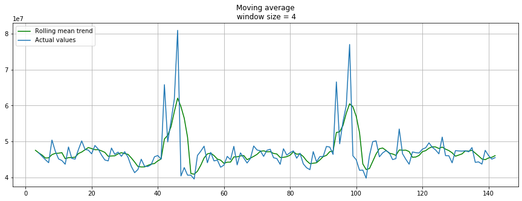

---
authors:
- admin
categories:
- Data Science
- Time Series
- Visualization
date: "2020-03-30T00:00:00Z"
draft: false
featured: false
image:
  caption: ''
  focal_point: ""
  placement: 2
  preview_only: false
lastmod: "2020-03-30T00:00:00Z"
projects: []
subtitle: 'Exploring Time series with visualization and identify neccessary trend, seasonality, cyclic in order to prepare for time series forecast'
summary: 'Exploring Time series with visualization and identify neccessary trend, seasonality, cyclic in order to prepare for time series forecast'
description: 'Exploring Time series with visualization and identify neccessary trend, seasonality, cyclic in order to prepare for time series forecast'
tags:
- Time series
- Forecast
- Visualization
- Seasonality
- Trend
- Seasonality
title: 'Complete guide for Time series Exploration and Visualization'
---

## 1. Time series patterns

Time series can be describe as the combination of 3 terms: **Trend**, **Seasonality** and **Cyclic**.

**Trend** is the changeing direction of the series. **Seasonality** occurs when there is a seasonal factor is seen in the series. **Cyclic** is similar with Seasonality in term of the repeating cycle of a similar pattern but differs in term of the length nd frequency of the pattern. 

<figure>
  
  <figcaption></figcaption>
</figure>

Looking at the example figure, there is no **trend** but there is a clear annual seasonlity occured in December. No cyclic as there is no pattern with frequency longer than 1 year.

## 2. Confirming seasonality

There are several ways to confirm the seasonlity. Below, I list down vizualization approaches (which is prefered by non-technical people).

### Seasonal plot: 

There is a large jump in December, followed by a drop in January.


Code can be found below (I am using the new Cyberpunk of Matplotlib, can be found [here](https://github.com/dhaitz/mplcyberpunk) with heptic neon color)

```python
colors = ['#08F7FE',  # teal/cyan
          '#FE53BB',  # pink
          '#F5D300'] # matrix green
plt.figure(figsize=(10,6))
w =data.groupby(['Year','Month'])['Weekly_Sales'].sum().reset_index()
sns.lineplot("Month", "Weekly_Sales", data=w, hue='Year', palette=colors,marker='o', legend=False)
mplcyberpunk.make_lines_glow()
plt.title('Seasonal plot: Total sales of Walmart 45 stores in 3 years',fontsize=20 )
plt.legend(title='Year', loc='upper left', labels=['2010', '2011','2012'],fontsize='x-large', title_fontsize='20')
plt.xticks(fontsize=14)
plt.yticks(fontsize=14);
```
### Seasonal subseries plot

Boxplot is a great tool to observe the time series pattern. 


### Moving average and Original series plot
<figure>
  
  <figcaption></figcaption>
</figure>

```python
def plotMovingAverage(series, window, plot_intervals=False, scale=1.96, plot_anomalies=False):

    rolling_mean = series.rolling(window=window).mean()
    
    plt.figure(figsize=(15,5))
    plt.title("Moving average\n window size = {}".format(window))
    plt.plot(rolling_mean, "g", label="Rolling mean trend")

    # Plot confidence intervals for smoothed values
    if plot_intervals:
        mae = mean_absolute_error(series[window:], rolling_mean[window:])
        deviation = np.std(series[window:] - rolling_mean[window:])
        lower_bond = rolling_mean - (mae + scale * deviation)
        upper_bond = rolling_mean + (mae + scale * deviation)
        plt.plot(upper_bond, "r--", label="Upper Bond / Lower Bond")
        plt.plot(lower_bond, "r--")
        
        # Having the intervals, find abnormal values
        if plot_anomalies:
            anomalies = pd.DataFrame(index=series.index, columns=series.columns)
            anomalies[series<lower_bond] = series[series<lower_bond]
            anomalies[series>upper_bond] = series[series>upper_bond]
            plt.plot(anomalies, "ro", markersize=10)
        
    plt.plot(series[window:], label="Actual values")
    plt.legend(loc="upper left")
    plt.grid(True)
    
plotMovingAverage(series, window, plot_intervals=True, scale=1.96,
                  plot_anomalies=True)
```

### ACF / PACF plots

The details of ACF and PACF plot implication can be found [here](https://geniusnhu.netlify.com/publication/arima-autoregressive-intergreated-moving-average/)
<figure>
  
  <figcaption>ACF / PACF plots</figcaption>
</figure>

```python
# ACF and PACF for time series data
series=train.dropna()
fig, ax = plt.subplots(2,1, figsize=(10,8))
fig = sm.graphics.tsa.plot_acf(series, lags=None, ax=ax[0])
fig = sm.graphics.tsa.plot_pacf(series, lags=None, ax=ax[1])
plt.show()
```
### Actual vs Predicted values plot
<figure>
  
  <figcaption>Actual vs Predicted values plot</figcaption>
</figure>

```python
def plotModelResults(model, X_train, X_test, y_train, y_test, plot_intervals=False, plot_anomalies=False):

    prediction = model.predict(X_test)
    
    plt.figure(figsize=(12, 8))
    plt.plot(prediction, "g", label="prediction", linewidth=2.0, color="blue")
    plt.plot(y_test.values, label="actual", linewidth=2.0, color="olive")
    
    if plot_intervals:
        cv = cross_val_score(model, X_train, y_train, 
                                    cv=tscv, 
                                    scoring="neg_mean_absolute_error")
        mae = cv.mean() * (-1)
        deviation = cv.std()
        
        scale = 1
        lower = prediction - (mae + scale * deviation)
        upper = prediction + (mae + scale * deviation)
        
        plt.plot(lower, "r--", label="upper bond / lower bond", alpha=0.5)
        plt.plot(upper, "r--", alpha=0.5)
        
        if plot_anomalies:
            anomalies = np.array([np.NaN]*len(y_test))
            anomalies[y_test<lower] = y_test[y_test<lower]
            anomalies[y_test>upper] = y_test[y_test>upper]
            plt.plot(anomalies, "o", markersize=10, label = "Anomalies")
    
    error = mean_absolute_percentage_error(y_test,prediction)
    plt.title("Mean absolute percentage error {0:.2f}%".format(error))
    plt.legend(loc="best")
    plt.tight_layout()
    plt.grid(True);

plotModelResults(linear, X_train, X_test, y_train, y_test,
                 plot_intervals=True, plot_anomalies=True)    
```

*To be updated*