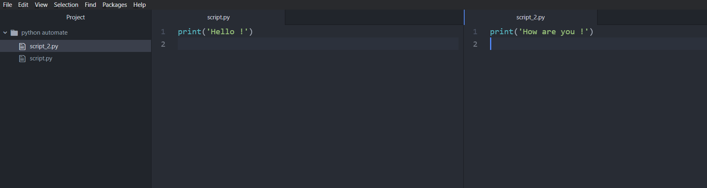
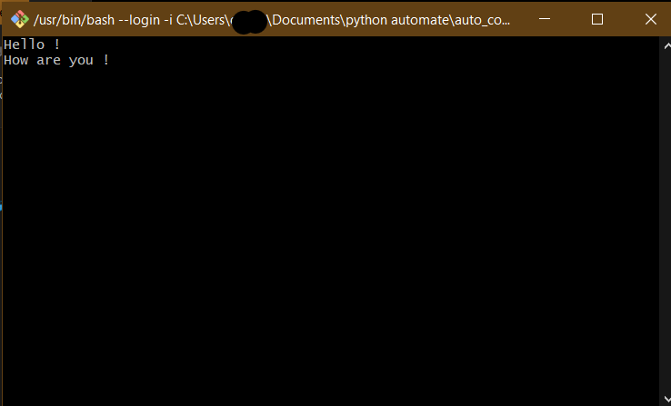
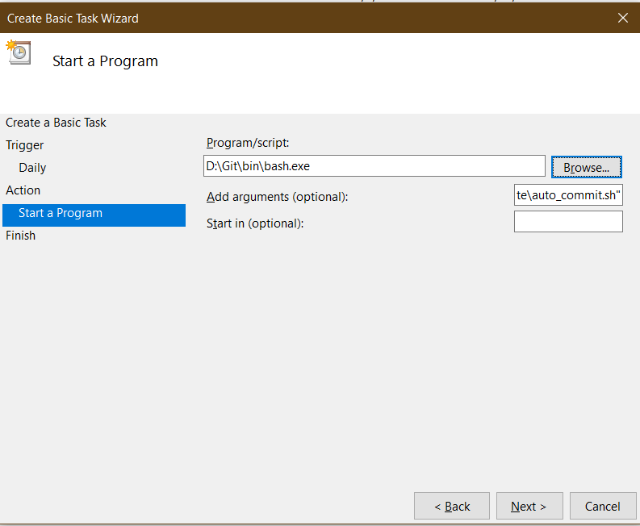

---
authors:
- admin
categories:
- Tips
date: "2020-04-02T00:00:00Z"
draft: false
featured: false
image:
  caption: ''
  focal_point: ""
  placement: 2
  preview_only: false
lastmod: "2022-01-01T00:00:00Z"
projects: []
subtitle: 'Automate Python script running in Windows with Task Scheduler'
summary: 'Automation Python script in Windows with Task Scheduler is different than doing it in Linux'
tags:
- Automation
title: 'Automate python script in Windows'
---

### Step 1. Create Python script

Create 2 simple scripts to print **"Hello !"** and **'How are you !'**

Then save them in ``` C:\Users\***\Documents\python automate\ ``` folder. (*** is the name of my computer)

<figure>
  
  <figcaption></figcaption>
</figure>

### Step 2. Create bash file

If only need to automate 1 python file, we can move to Step 3 directly but in case we have sevaral files needed to be run concurrently, creating a bash file is more efficient.

However, in order to run bash file in Windows for python script, you should install Git for Windows. Download link is [here](https://gitforwindows.org/)

:ledger: Remember to install Python and specify the path in the bash file so that the program knows where to run the scripts.

Here is what it is written in the bash file :pushpin:

```bash
#!/bin/sh

export PATH="$PATH:/c/Users/***/AppData/Local/Programs/Python/Python39"

python script.py
sleep 1s
python script_2.py
sleep 1s

```

We can move to the folder that the scripts are in (if needed) by specifying the path with ``` cd ``` . In this case, the bash file is placed in the same folder with other 2 Python scripts.

> One way to confirm if the bash file works is to save and then doouble click on it. It will run the process that we set up before and if it executed correctedly, everything is on the job.


<figure>
  
  <figcaption>:vertical_traffic_light: CORRECTEDLY RUN ! CHECK ! :vertical_traffic_light:</figcaption>
</figure>

### Step 3. Create a task to run in Task Scheduler

1. Type **Task Scheduler** in the search bar of Windows
2. Click **Create Basic Task**
3. Set **Name**, **Description**, then **Next**
4. Set trigger time and frequency, then **Next**
5. Specify Action with **Start a program**, then **Next**
6. In **Program/script**, specify path to the Git\bin\bash.exe (the bash is in the folder that we installed the Git for Windows) 
7. In **Add arguments (optional)**, write path to the above bash file (in this case is ``` "C:\Users\***\Documents\python automate\auto_commit.sh" ```), then **Next**

<figure>
  
  <figcaption></figcaption>
</figure>

8. Click **Finish**

### Step 4. Check the run

1. Recheck the path. After we set the automation, the Path is moved to ``` C:\WINDOWS\system32\ ``` automatically, so we need re-specify the path to the python scripts in bash file. 

Add 

```bash
cd C:
cd Users\***\Documents\"python automate" 
```

New script :arrow_down:

```bash
#!/bin/sh

export PATH="$PATH:/c/Users/***/AppData/Local/Programs/Python/Python39"

cd C:
cd Users/***/Documents/"python automate"/
sleep 1s
python script.py
sleep 3s
python script_2.py
sleep 1s
```

2. Choose the task that we has just set for the Python script and click **Run**

3. Check if it outputs the same as one we had in Step 2

## That's it  ! Good luck !  :high_brightness: 


