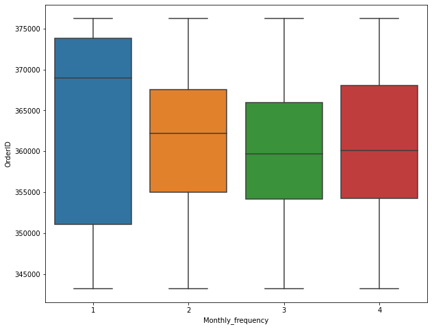

---
authors:
- admin
categories:
- Visualization
- Analytics
date: "2020-04-02T00:00:00Z"
draft: false
featured: false
image:
  caption: ''
  focal_point: ""
  placement: 2
  preview_only: false
lastmod: "2020-04-02T00:00:00Z"
projects: []
subtitle: 'Insightful charts to visualize data with Python source code'
summary: 'All visualization with code: bar chart, line chart, pie chart, violin chart, scatter chart, donut chart and customization'
tags:
- Visualization
- Trend
- Analytics
title: 'Useful visualization with source code'
---

Useful charts created with Python code

## 1. Continuous variable with Categorical variable
**Bar chart**

Show trend/values among categorical variables.

This serves best in case of showing the differene between various categories.

```python
ax = data[['x','y']].plot(kind='bar', figsize =(8,5))
positions = (0,1, 2, 3)
ax.set_xticklabels(["2015", "2016", "2017", "2018"], rotation=30)
ax.set_title('Sales and number of order')
for i in ax.patches:
    # get_x pulls left or right; get_height pushes up or down
    ax.text(i.get_x()+.01, i.get_height()+50, \
            str(round((i.get_height()), 2)), fontsize=12);
```

<figure>
  
  <figcaption>Bar chart: 2 categorical variables with continuous vales</figcaption>
</figure>

**Subplots for multiple categorical variables**

Breaking several categories into different subplots will help generating insights, which is related to trend of each category.

```python
plt.figure(figsize=(20,10))
plt.subplot(221)
data[data['type']==0].groupby('Y')['Quantity'].sum().plot(color='green', linewidth=7.0)
plt.title('Item Quantity - Product class 0')
plt.xlabel(xlabel='')
plt.xticks([]) # delete the x axis tick value
plt.subplot(222)
data[data['type']==2].groupby('Y')['Quantity'].sum().plot(color='red',linewidth=7.0)
plt.title('Item Quantity - Product class 2')
# Other subplot can continue with plt.subplot(223) ...
```
<figure>
  
  <figcaption>Line subplot: 2 categorical variables with continuous vales</figcaption>
</figure>

This can also be changed to **Mutiple lines plot** as below

```python
plt.plot(data['line1'], label='Line 1')
plt.plot(data['line1'], color='red', label='Line 2')
plt.legend()
plt.title('2 Line plot')
plt.show()
```
<figure>
  
  <figcaption>Multiple Line plot</figcaption>
</figure>

**Box plot (distribution box plot)**

Talking about distribution, boxplot will initiate many insights, especially when it is used to **detect outlier**.

```python
fig_dims = (10, 8)
fig, ax = plt.subplots(figsize=fig_dims)
sns.boxplot(x='X', y='Y', data=data)
```
<figure>
  
  <figcaption>Box plot - Distribution vizualization</figcaption>
</figure>

**Polar chart**

THe below **Polar chart** used to **detech seasonality** among 12 months. It is clearly seen that the data at November and December observed spike or in orderword, an annual seasonality.

```python
import plotly.express as px
data['Month'] = data['Date'].dt.month_name()
fig = px.line_polar(data, theta="Month",r="Weekly_Sales",
                    color='Year',
                    line_close=True,template="plotly_dark")
fig.show();
```
<figure>
  
  <figcaption>Polar chart</figcaption>
</figure>

## 2. Continuous with continuous variables

**Scatter plot**

One of the most popular type of plot to observe the **relationship** between 2 variables and sometimes help identify the **correlation** between features. ```corr``` function is used to get this correlation.

```python
fig_dims = (8,5)
fig, ax = plt.subplots(figsize=fig_dims)
abc = data.groupby(['A','B','C']).agg({'D':'sum'}).reset_index()
sns.scatterplot(x='C', y='A', hue='B', data=abc, palette="Set2").set(title = 'Order throughout a month');
```
<figure>
  
  <figcaption></figcaption>
</figure>

## 3. Percentage plot

**Pie chart**

There is a controversy that **pie chart** can hardly do a good job in representing the percentage. However, if the number of catogories are low, aka below 6, Pie chart proves no problem.

```python
labels = 'G1','G2', 'G3',  'G4'

fig1, ax1 = plt.subplots(figsize=(5,5))
ax1.pie(data.groupby('ProductClass').agg({'ItemID':'count'}), labels=labels, autopct='%1.1f%%',
        shadow=True, startangle=90)
ax1.axis('equal')  # Equal aspect ratio ensures that pie is drawn as a circle.
plt.title('Proportion of each Group')
plt.show();
```
<figure>
  
  <figcaption>Pie plot</figcaption>
</figure>

**Donut chart (Multiple categorical variables with percentage)**

**Donut chart** is the combination of 2 **pie chart**, the smaller lies within the bigger. This shows the percentage within of the big group as well as the proportion within each subgroup, which provides a transparent distribution of 2 categorical variables within each other.

```python
subgroup_names = 'PC0','PC1','PC2','PC0','PC1','PC2','PC3','PC0','PC1','PC2','PC3'
labels = 'Group 1','Group 2', 'Group 3'

# Create colors
a, b, c=[plt.cm.Blues, plt.cm.Reds, plt.cm.Greens]
fig, ax = plt.subplots(figsize=(5,5))
ax.axis('equal')
mypie, _ = ax.pie(list(data.groupby(['group']).agg({'Order':'nunique'}).Quantity), 
                  radius=1.3, labels=labels, colors=[a(0.6), b(0.6), c(0.6)] , labeldistance=1.05)
plt.setp( mypie, width=0.3, edgecolor='white')

mypie2, _ = ax.pie(list(data.groupby(['group','subgroup']).agg({'Order':'nunique'}).Quantity), 
                   radius=1.3-0.3, labels=subgroup_names, 
                   labeldistance=0.8, colors=[a(0.5), a(0.4), a(0.3), b(0.5), b(0.4), b(0.3), b(0.2),c(0.5), 
                                              c(0.4), c(0.3),c(0.2)])
plt.setp( mypie2, width=0.4, edgecolor='white')
plt.title('Proportion of by groups and subgroups');
```
<figure>
  
  <figcaption>Donut chart</figcaption>
</figure>

## 4. Change in Order plot

**Bump chart**

"How the rank changes over time" is the question that is answered by the below graph, called **Bump chart**

<figure>
  
  <figcaption>Change in order</figcaption>
</figure>


```python
def bumpchart(df, show_rank_axis= True, rank_axis_distance= 1.1, 
              ax= None, scatter= False, holes= False,
              line_args= {}, scatter_args= {}, hole_args= {}, number_of_lines=10):
    
    if ax is None:
        left_yaxis= plt.gca()
    else:
        left_yaxis = ax

    # Creating the right axis.
    right_yaxis = left_yaxis.twinx()
    
    axes = [left_yaxis, right_yaxis]
    
    # Creating the far right axis if show_rank_axis is True
    if show_rank_axis:
        far_right_yaxis = left_yaxis.twinx()
        axes.append(far_right_yaxis)
    
    for col in df.columns:
        y = df[col]
        x = df.index.values
        # Plotting blank points on the right axis/axes 
        # so that they line up with the left axis.
        for axis in axes[1:]:
            axis.plot(x, y, alpha= 10)

        left_yaxis.plot(x, y, **line_args, solid_capstyle='round')
        #left_yaxis.annotate(x,xy=(3,1))
        # Adding scatter plots
        if scatter:
            left_yaxis.scatter(x, y, **scatter_args)
            for x,y in zip(x,y):
              plt.annotate(col, 
                          (x,y), 
                          textcoords="offset points", 
                          xytext=(0,10), 
                          ha='center') 
            
            #Adding see-through holes
            if holes:
                bg_color = left_yaxis.get_facecolor()
                left_yaxis.scatter(x, y, color= bg_color, **hole_args)

    # Number of lines
     

    y_ticks = [*range(1, number_of_lines+1)]
    
    # Configuring the axes so that they line up well.
    for axis in axes:
        axis.invert_yaxis()
        axis.set_yticks(y_ticks)
        axis.set_ylim((number_of_lines + 0.5, 0.5))
    
    # Sorting the labels to match the ranks.
    left_labels = [*range(1, len(df.iloc[0].index))]
    right_labels = left_labels
    #left_labels = df.iloc[0].sort_values().index
    #right_labels = df.iloc[-1].sort_values().index
    
    left_yaxis.set_yticklabels(left_labels)
    right_yaxis.set_yticklabels(right_labels)
    
    # Setting the position of the far right axis so that it doesn't overlap with the right axis
    if show_rank_axis:
        far_right_yaxis.spines["right"].set_position(("axes", rank_axis_distance))
    
    return axes
```
## 5. Other customization
**Add x axis tick label**

```python
data[['x','y']].plot(kind='bar',figsize =(8,5))
positions = (0,1, 2, 3)
labels = ("2015", "2016", "2017", "2018")
plt.xticks(positions, labels, rotation=0) #Assign x axis tick labels
plt.ylabel('Sales', fontsize =12)
plt.xlabel('')
plt.title('Sales by year');;
```
<figure>
  
  <figcaption>Custome x axis tick labels</figcaption>
</figure>

**Set legend label**

```
plt.legend(['Qty by day in week','# of daily orders'])
```

*To be updated*