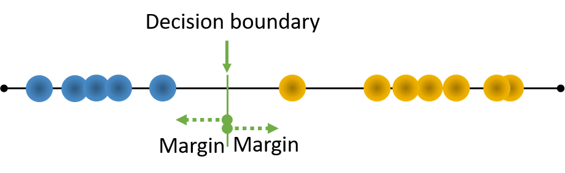
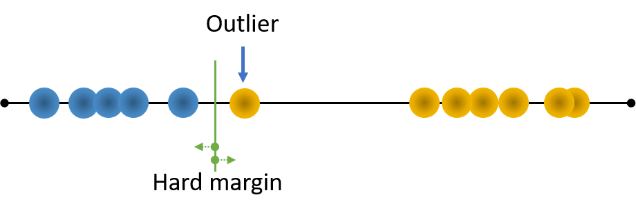
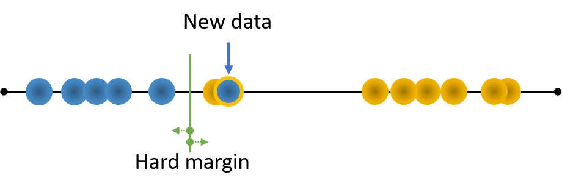
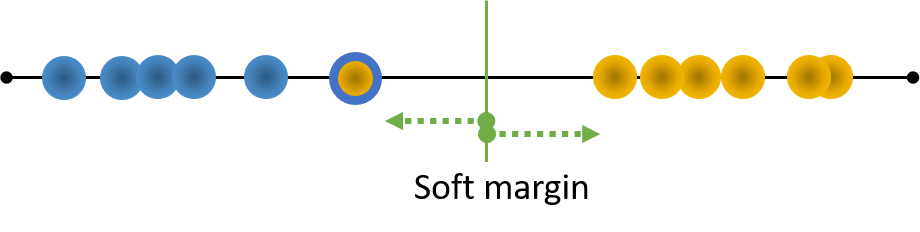
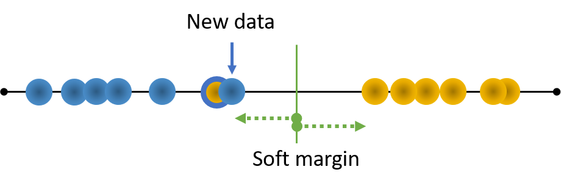
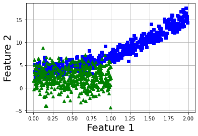
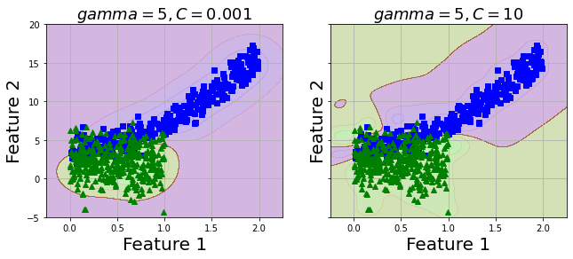

---
authors:
- admin
categories:
- Data Science
- Support Vector Machine
- Classification
date: "2020-04-30T00:00:00Z"
draft: false
featured: false
image:
  caption: ''
  focal_point: ""
  placement: 2
  preview_only: false
lastmod: "2020-04-30T00:00:00Z"
projects: []
subtitle: 'How to make Support Vector Machine algorithm do exactly the way you want'
summary: 'How to make Support Vector Machine algorithm do exactly the way you want'
description: 'Explain of Support Vector Machine from scratch'
tags:
- Support Vector Machine
- Classification
- Application
title: 'Support Vector Machine explanation and application'
---

In a classification task, there are several ways to do the trick. It can be solved by separating classes by linear (straight) line, or using a tree to split up attributes according to certain thresholds until reaching to the expected level, or calculating the probability of the event to belong to which class.

Support Vector Machine is a **non-probabilistic binary linear classifier** and a versatile Machine Learning algorithm that can perform both **classification and regression tasks**. Another advantages of SVM is its ability to solve on both **linear and non-linear datasets**.

Given these numerous benefits, there are many concepts and solutions in SVM that I found just a few articles/videos really gives an easily understandable explanation, especially targeting ones who are new to SVM. I hope this post reach you in the most comprehensive way.

---

## Original concept

All of this started with the idea of using a line (with 2D dataset) or a hyperplane (more than 3D) to separate the instances into 2 classes, and try to **maximize the distance between the line and the closest instances**. This distance is denoted as **Margin**. The below figure illustrates this.

<figure>
  
  <figcaption></figcaption>
</figure>

Why it needs to maximize this margin? The reason is that a Decision boundary lies right between 2 classes is much better than one that falls nearer at one class than another.

However, imagine that there is an **outlier** of the Orange class and it lies closers to Blue class than its own. If we strictly impose the above concept to this dataset, it will result into the below picture. Now, the margin satisfies the requirement but turns out to be much smaller than the above one. This is called **Hard margin**.

<figure>
  
  <figcaption></figcaption>
</figure>

If there is a new Blue class data that falls near this orange instance, that new data will be misclassified as Orange, which in other word, means the model performs worse on new data than on train one (which we never wants to have with our model).

<figure>
  
  <figcaption></figcaption>
</figure>

## Soft margin

There is one way to solve this, by allowing some misclassification on outliers of train set to maximize the margin on the rest of training data. This concept was named **Soft margin** or in other word, **Support Vector Machine**.

<figure>
  
  <figcaption></figcaption>
</figure>

Once there is new data, it will be correctly classified as Blue.

<figure>
  
  <figcaption></figcaption>
</figure>

Then, one question arises. How can we decide the Soft margin? (How do we know which instances to be misclassified in training?).

Actually, there is no perfect answer for this. You train the data on several values of margin decides to use the optimal one for your problem. The hyperparameter controls this in VC models in scikit-learn is denoted as $C$. If the model is overfitting, reduce $C$.

It is also because that SVM uses only 1 linear line or hyperplane to do the classification job, it is a binary classification solver. In case of multiclass problem, +One-versus-All (or One-versus-Rest) strategy* will be implied.

> **Therefore, one of the most important rule of SVM algorithm is that it tries to find a good balance between maximizing the margin street, and limiting the Margin violation (misclassification)**

## SVM on non-linear dataset

However, for non-linear separable data, how can we use this trick? Looking at the below illustration, we will need 3 lines to separate the data into 2 classes, and with more complex data, we will need even more. This is computationally inefficient.

<figure>
  
  <figcaption></figcaption>
</figure>

Then, here comes the **Kernel trick**. 

Instead of teaching the model on 2D data, the **kernel trick** will add other features such as polynomial features and then SVM will utilize a hyperplane to split up data into 2 classes. The above data after adding 2-degree polynomial feature will look like this:

<figure>
  
  <figcaption>After quadratic feature added, instances  are now distintively separated into 2 classes</figcaption>
</figure>

---

Let's use data to further understand this.

```python
import random
np.random.seed(42)
m = 500
X1 = 2 * np.random.rand(m, 1)
X2 = (4 + 3 * X1**2 + np.random.randn(m, 1)).ravel()
X12 = np.column_stack((X1,X2))
y1 = np.zeros((500))
X3 = np.random.rand(m, 1)
X4 = (1 + X1**1 + 2*np.random.randn(m, 1)).ravel()
X34 = np.column_stack((X3,X4))
y2 = np.ones((500))
X = np.concatenate((X12, X34), axis=0)
y = np.concatenate((y1, y2), axis=0)

def plot_dataset(X, y, axes):
    plt.plot(X[:, 0][y==0], X[:, 1][y==0], "bs")
    plt.plot(X[:, 0][y==1], X[:, 1][y==1], "g^")
    plt.axis(axes)
    plt.grid(True, which='both')
    plt.xlabel("Feature 1", fontsize=20)
    plt.ylabel("Feature 2", fontsize=20, rotation=0)
    
plot_dataset(X, y, [-1.5, 2.5, -1, 1.5])
plt.show();
```
<figure>
  
  <figcaption>Vizualize data with 2 classes</figcaption>
</figure>

## Polynomial kernel

I used *SVC* class in scikit-learn with polynomial kernel at 3 degree with $coef$ hyperparameter equals to 1 (it controls how much the model is influenced by high-degree vs low-degree polynomials). $LinearSVC(loss="hinge")$ with an prior $PolynomialFeatures(degree=3)$ transformer will do the same trick.

If you have very large dataset, go ahead with $LinearSVC$ because it is faster than $SVC$ in handling big data.

> **One thing to remember, always scaling data before training SVM**

```python
poly_kernel_svm_clf = Pipeline([
	("scaler", StandardScaler()),
	("svm_clf", SVC(kernel="poly", degree=3, coef0=1, C=0.001))
])
poly_kernel_svm_clf.fit(X_train, y_train)

poly_kernel_svm_clf10 = Pipeline([
	("scaler", StandardScaler()),
	("svm_clf", SVC(kernel="poly", degree=3, coef0=1, C=10))
])
poly_kernel_svm_clf10.fit(X_train, y_train)

# Plot the model overall prediction
def plot_predictions(model, axes):
    """
    Vizualize the classification result of the model to see how it
    corresponds to training data
    """
    x0s = np.linspace(axes[0], axes[1], 1000)
    x1s = np.linspace(axes[2], axes[3], 1000)
    x0, x1 = np.meshgrid(x0s, x1s)
    X = np.c_[x0.ravel(), x1.ravel()]
    y_pred = model.predict(X).reshape(x0.shape)
    y_decision = model.decision_function(X).reshape(x0.shape)
    plt.contourf(x0, x1, y_pred, cmap=plt.cm.brg, alpha=0.2)
    plt.contourf(x0, x1, y_decision, cmap=plt.cm.brg, alpha=0.1)
    
fig, axes = plt.subplots(ncols=2, figsize=(10.5, 4), sharey=True)
plt.sca(axes[0])
plot_predictions(poly_kernel_svm_clf, [-0.25,2.25,-5,20])
plot_dataset(X_train, y_train)
plt.title(r"$degree=3, C=0.001$", fontsize=18)

plt.sca(axes[1])
plot_predictions(poly_kernel_svm_clf10, [-0.25,2.25,-5,20])
plot_dataset(X_train, y_train)
plt.title(r"$degree=3, C=10$", fontsize=18)
plt.show()
```
<figure>
  
  <figcaption>Vizualize data with 2 classes</figcaption>
</figure>

The model with value of C equals to 10 seems to get to the point quite well, let's measure its performance on test set.

```python
from sklearn.metrics import f1_score
model_list = [rbf_kernel_svm_clf,rbf_kernel_svm_clf10]

for model in model_list:
    y_pred = model.predict(X_test)
    print(f1_score(y_test, y_pred, average='weighted'))
    
    
0.6459770114942529
0.8542027171311809
```
## Gaussian RBF Kernel

Now, I want to try a different kernel with this data, I will use  **Gaussian RBF Kernel**.

As my data is not too large, *Gaussian RBF Kernel* does not take much time. However, with a large dataset, *Gaussian RBF Kernel* will consume quite amount of your time.

```python
from sklearn.svm import SVC
from sklearn.preprocessing import StandardScaler
from sklearn.pipeline import Pipeline
from sklearn.model_selection import train_test_split

X_train, X_test, y_train, y_test = train_test_split(X, y,test_size=0.33, random_state=42)

# Create pipeline for training
rbf_kernel_svm_clf = Pipeline([
	("scaler", StandardScaler()),
	("svm_clf", SVC(kernel="rbf", gamma=0.1, C=0.001))
])
rbf_kernel_svm_clf.fit(X_train, y_train)

rbf_kernel_svm_clf10 = Pipeline([
	("scaler", StandardScaler()),
	("svm_clf", SVC(kernel="rbf", gamma=5, C=10))
])
rbf_kernel_svm_clf10.fit(X_train, y_train)

# Plot the model overall prediction
fig, axes = plt.subplots(ncols=2, figsize=(10.5, 4), sharey=True)
plt.sca(axes[0])
plot_predictions(rbf_kernel_svm_clf, [-1.5, 2.5, -1, 1.5])
plot_dataset(X_train, y_train)
plt.title(r"$gamma=5, C=0.001$", fontsize=18)

plt.sca(axes[1])
plot_predictions(rbf_kernel_svm_clf10, [-1.5, 2.5, -1, 1.5])
plot_dataset(X_train, y_train)
plt.title(r"$gamma=5, C=10$", fontsize=18)
plt.show();
```
<figure>
  
  <figcaption>Vizualize data with 2 classes</figcaption>
</figure>

2 values of C seems to produce similar model. Let's predict test set and evaluate with metrics.

```python
from sklearn.metrics import f1_score
model_list = [rbf_kernel_svm_clf,rbf_kernel_svm_clf10]

for model in model_list:
    y_pred = model.predict(X_test)
    print(f1_score(y_test, y_pred, average='weighted'))
    
    
0.8417207792207791
0.8544599213495534
```

As expected, 2 models perform quite equivalent with C = 10 has slightly higher value and also slightly higher than the polynomial kernel model above. We can improve this with tuning hyperparameter, cross validation, add other type of feature transformation.