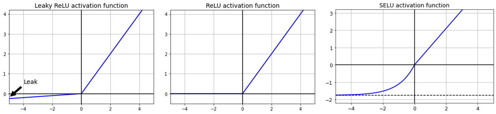
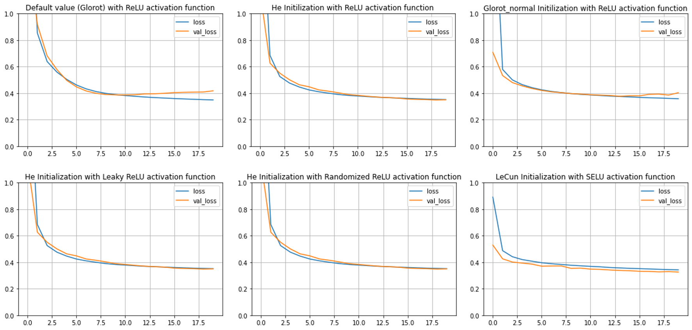
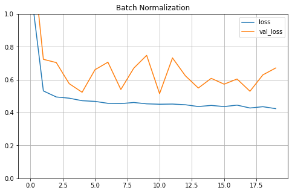

---
authors:
- admin
categories:
- Data Science
- Deep learning
date: "2020-05-30T00:00:00Z"
draft: false
featured: false
image:
  caption: ''
  focal_point: ""
  placement: 2
  preview_only: false
lastmod: "2020-05-30T00:00:00Z"
projects: []
subtitle: 'Speed up training and improve performance in deep neural net. Part 1: Initialization, Activation function and Batch Normalization/Gradient Clipping'
summary: 'Discussion of 5 popular techniques to speed up training in deep neural net (Initialization, Activation function and Batch Normalization/Gradient Clipping) using TensoFlow'
description: 'Discussion of 5 popular techniques to speed up training and improve performance in deep neural net (Initialization, Activation function and Batch Normalization/Gradient Clipping) using TensoFlow'
tags:
- Deep learning
- Data Science
- Initialization
- Activation function
- Batch Normalization
- Tensorflow
- Hyperparameter tuning
title: 'Speed up training and improve performance in deep neural net'
---

Training a large and deep neural network is a time and computation consuming task and was the main reason for the unpopularity of DNN 20 years ago. As several techniques have been found out to push up the training speed, Deep learning has come back to the light. So which technique to use, how and when to use which? Let's discuss it here! 

*Performance summary is shown at the end of the post for Classification & Regression examples*

---

## 1. Applying Initialization 

Initialization is one of the first technique used to fasten the training time of Neuron Network (as well as improve performance). Let's briefly explain its importance. In Artificial Neural Network (ANN), there are numerous connections between different neurons. One neuron in the current layer connects to several neurons in the next layer and is attached to various ones in the previous layer. If 2 neurons interact frequently than another pair, their connection (i.e the weights) will be stronger than the other one. 

However, one problem with the ANN is that if the weights aren't specified from the beginning of training, the connection weights can be either too small or too large which makes them too tiny or too massive to use further in the network. In other words, the network will fall into **Vanishing Gradients** or **Exploding Gradients** problems.

So if the weights are set at suitable random values from the beginning of the training, these problem can be avoided. This technique was proposed by [Glorot and Bengio](http://www.jmlr.org/proceedings/papers/v9/glorot10a/glorot10a.pdf), which then significantly lifted these unstable problems. This initialization strategy is called *Xavier initialization* or *Glorot initialization*.

In this strategy, the connection weights between neurons are initialized randomly using the Normal distribution with $mean=0$ and variance $\sigma^2 = \frac{2}{fan_{in}+fan_{out}}$ , in which $fan_{in}$ is the number of input neurons and $fan_{out}$ is the number of output neurons.

There are 2 other popular initialization techniques beside **Glorot** (used in Keras as default): **He** and **LeCun**. 

Let's examine different initialization techniques' effect on model performance and training time with ```fashion MNIST``` dataset.

```python
plt.figure(figsize=(10, 10))
for row in range(5):
  for col in range(5):
    index = 5 * row + col
    plt.subplot(5, 5, index + 1)
    plt.imshow(X_train_full[index], cmap="binary", interpolation="nearest")
    plt.axis('off')
    plt.title(y_train_full[index], fontsize=12)
plt.show()
```
<figure>
  
  <figcaption>Here is the example of Fashion MNIST, in which the predictors are a set of values in the shape of [28,28] representing the image; and the target value is 10 types of cloth and shoes (denoted from 0 to 9)</figcaption>
</figure>

First, let's start with the default setting of Keras on a network consisting of 5 hidden layers and 300, 100, 50, 50, 50 neurons each.

```python
tf.random.set_seed(50)
np.random.seed(50)

model_default = keras.models.Sequential()
model_default.add(keras.layers.Flatten(input_shape=[28, 28]))
for n_layers in (300, 100, 50, 50, 50):
  model_default.add(keras.layers.Dense(n_layers, activation ='relu'))
model_default.add(keras.layers.Dense(10, activation='softmax'))
    
model_default.compile(loss="sparse_categorical_crossentropy",
                      optimizer=keras.optimizers.SGD(lr=1e-3),
                      metrics=["accuracy"])

start_time = time.time()
history = model_default.fit(X_train_full, y_train_full, epochs=20, validation_split=0.1)
print("--- %s seconds ---" % (time.time() - start_time))
```
Result
```python
# Show the highest accuracy epoch
Epoch 20/20
1688/1688 [==============================] - 5s 3ms/step - loss: 0.4185 - accuracy: 0.8526 - val_loss: 0.4256 - val_accuracy: 0.8518
--- 99.03307843208313 seconds ---
```
The train set reached 85.26% accuracy and Val set reached 85.18% within 99.3 seconds. If ```activation ='relu'``` is not set (i.e. no Activation function in the hidden layers), the accuracy is 85.32% and 84.95% respectively with 104.5 seconds needed to train on.

Comparing this with weight initialization to all Zeros and all Ones:
```python
# Zeros initialization
Epoch 20/20
1688/1688 [==============================] - 3s 2ms/step - loss: 2.3026 - accuracy: 0.1008 - val_loss: 2.3028 - val_accuracy: 0.0925
--- 69.43926930427551 seconds ---

# Ones initialization
Epoch 20/20
1688/1688 [==============================] - 3s 2ms/step - loss: 2.3026 - accuracy: 0.1008 - val_loss: 2.3028 - val_accuracy: 0.0925
--- 67.2280786037445 seconds ---
```
The performance in both cases is much worse and actually the model stopped improving from 5th epoch.

Another Initialization that can be considered to use is ```He Initialization```,  enabling in Keras by adding ```kernel_initializer="he_normal"``` argument to the hidden layers.

Result
```python
# Show the highest accuracy epoch
Epoch 20/20
1688/1688 [==============================] - 5s 3ms/step - loss: 0.3780 - accuracy: 0.8672 - val_loss: 0.3924 - val_accuracy: 0.8637
--- 99.76096153259277 seconds ---
```
The accuracy actually improved but the running time was half a second slower than **Glorot Initialization**

There are also discussions about the performance of **normal distribution** and **uniform distribution** in initialization technique, but there is indeed no one shows better performance than the other one. The result of ```init = keras.initializers.VarianceScaling(scale=2.,mode='fan_avg',distribution='uniform')``` does not improve for this data set (Train set accuracy: 87.05%, Val set: 86.27% and took 100.82 seconds to run)

## 2. Get along with the right Activation function
Choosing an unfit activation function is one of the reasons leading to poor model performance. ```sigmoid``` might be a good choice but I prefer to use **SELU, ReLU, or its variants** instead.

Let's talk about **ReLU** first. Simply saying, if the value is larger than 0, the function returns the value itself; else it returns 0. This activation is fast to compute but in return there will be a case that it stops outputting anything other than 0 (i.e neurons were died). This issue usually happens in case of a large learning rate. 

<figure>
  
  <figcaption>ReLU, Leaky ReLU and SELU</figcaption>
</figure>

Some of the solutions for this problem is to use alternative versions of ReLU: **LeakyReLU, Randomized LeakyReLU or Scaled ReLU (SELU)**.

With **LeakyReLU**:
```python
if x>0:
  return x
else:
  return ax
```
in which a is $\alpha$, the slope of the $x$ given $x<0$. $\alpha$ is usually set at 0.01, serving as a small leak (that's why this technique is called LeakyReLU). Using $\alpha$ helps to stop the dying problem (i.e. slope=0).

In case of **Randomized LeakyReLU**, $\alpha$ is selected randomly given a range. This method can reduce the Overfitting issue but requires more running time due to extra computation.

One of the outperformed activation function for DNN is **Scaled ReLU (SELU)**. 

```python
if x>0:
  return Lambda*x
else:
  return Lambda*(alpha*exp(x)-alpha)
```

In this function, each layer outputs' mean is 0 and standard deviation is 1. Note when using this activation function:
- [x] It must be used with ```kernel_initializer="lecun_normal"```
- [x] The input features must be standardized
- [x] The NN's architecture must be sequential

Let's try different Activation functions on the ```fashion MNIST``` dataset.

Result of **LeakyReLU**
```python
# Show the highest accuracy epoch
Epoch 20/20
1688/1688 [==============================] - 5s 3ms/step - loss: 0.3791 - accuracy: 0.8670 - val_loss: 0.3910 - val_accuracy: 0.8615
--- 101.87710905075073 seconds ---
```

Result of **Randomized LeakyReLU**

```python
# Show the highest accuracy epoch
Epoch 20/20
1688/1688 [==============================] - 6s 3ms/step - loss: 0.3779 - accuracy: 0.8667 - val_loss: 0.3918 - val_accuracy: 0.8630
--- 113.58738899230957 seconds ---
```
Result of **SELU**

```python
# Show the highest accuracy epoch
Epoch 19/20
1688/1688 [==============================] - 5s 3ms/step - loss: 0.3526 - accuracy: 0.8763 - val_loss: 0.3755 - val_accuracy: 0.8647
--- 106.25733232498169 seconds ---
```
**SELU** seems to achieve slightly better performance over ReLU and its variants but the speed is slower (as expected).

**If the NN performs relatively well at a low learning rate, ReLU is an optimal choice given the fastest training time. In case of the deep NN, SELU is an excellent try.**

Detailed explanation about these activations can be found in here: [ReLU](http://www.jmlr.org/proceedings/papers/v9/glorot10a/glorot10a.pdf), [LeakyReLU, Randomized LeakyReLU](https://arxiv.org/abs/1505.00853) and [SELU](https://arxiv.org/abs/1706.02515)

## 3. Batch Normalization
To ensure Vanishing/Exploding Gradients problems do not happen again during training (as Initialization and Activation function can help reduce these issues at the beginning of the training), **Batch Normalization** is implemented.

**Batch Normalization** zeros centers and normalizes each input, then scales and shifts the result using 1 parameter vector for scaling and 1 for shifting. This technique evaluates the $mean$ and $standard deviation$ of the input over the current mini-batch and repeats this calculation across all mini-batches of the training set. $\mu$ and $\sigma$ are estimated during training but only used after training.

The vector of input means $\mu$ and vector of input standard devition $\sigma$ will become non-trainable parameters (i.e. untouchable by backpropagation) and be used to compute the moving averages at the end of the training. Subsequently, these final parameters will be used to normalize new data to make prediction.

If using **Batch Normalization**, the input data will not need to be standardized prior training.

```python
tf.random.set_seed(50)
np.random.seed(50)

model_default = keras.models.Sequential()
model_default.add(keras.layers.Flatten(input_shape=[28, 28]))
for n_layers in (300, 100, 50, 50, 50):
  model_default.add(keras.layers.BatchNormalization())
  model_default.add(keras.layers.Dense(n_layers, activation ='relu', kernel_initializer="he_normal"))
model_default.add(keras.layers.Dense(10, activation='softmax'))
    
model_default.compile(loss="sparse_categorical_crossentropy",
                      optimizer=keras.optimizers.SGD(lr=1e-3),
                      metrics=["accuracy"])

start_time = time.time()
history = model_default.fit(X_train_full, y_train_full, epochs=20, validation_split=0.1)
print("--- %s seconds ---" % (time.time() - start_time))
```
Result
```python
# Show the highest accuracy epoch
Epoch 20/20
1688/1688 [==============================] - 8s 5ms/step - loss: 0.3799 - accuracy: 0.8645 - val_loss: 0.3571 - val_accuracy: 0.8685
--- 167.6186249256134 seconds ---
```
Obviously, training is slower in **Batch Normalization** given more computations during training but in contrast, in **Batch Normalization**, the model convergences faster so fewer epoches are needed to reach the same performance.

{}
Batch Normalization is strictly implemented in Recurrent NN
{}

## 4. Gradient Clipping
As **Batch Normalization** is recommended not to use with Recurrent NN, **Gradient Clipping** is the alternative choice for RNN.

Details about [Gradient Clipping](https://arxiv.org/abs/1211.5063)

---

## Summary of the result of Classification task with Fashion MNIST dataset

| Initialization | Activation fuction | Train set accuracy | Val set accuracy | Running time (seconds) |
| ------ |:------:|:------------------:|:----------------:| :----------------------:|
| Glorot - Zeros/Ones | ReLU | 10.08% | 9.25% | 69.43/67.22 |
| Glorot | None | 85.32% | 84.95% | 104.5 |
| Glorot - Normal Dist | ReLU | 85.26%      |   85.18% | 99.03 |
| He - Normal Dist | ReLU | 86.72%      |    86.37% | 99.76 |
| He - Uniform  Dist | ReLU | 87.05%      |    86.27% | 100.82 |
| He - Normal  Dist | Leaky ReLU | 86.7%      |    86.15% | 101.87 |
| He - Normal  Dist | Randomized LeakyReLU | 86.67%      |    86.3% | 113.58 |
| LeCun | SELU | 87.63%      |    86.47% | 106.25 |
| Batch normalization He - Normal  Dist | ReLU | 86.45%      |    86.85% | 167.618 |

## Summary of the result of Regression task with California housing dataset

| Initialization | Activation fuction | Train set MSE | Val set MSE | Running time (seconds) |
| ------ |:------:|:------------------:|:----------------:| :----------------------:|
| Glorot | None | 0.3985 | 0.3899 | 9.34 |
| Glorot - Normal Dist | ReLU | 0.3779 |  0.3819 | 9.36 |
| He - Normal Dist | ReLU | 0.3517 |  0.35 | 9.19 |
| He - Normal  Dist | Leaky ReLU | 0.3517   |   0.35 | 9.48 |
| He - Normal  Dist | Randomized LeakyReLU | 0.3517  | 0.35 | 10.71 |
| LeCun | SELU | 0.3423  |  0.326 | 9.38 |
| Batch normalization He - Normal  Dist | ReLU | 0.4365 | 0.5728 | 13.64 |

MSE of Train and Validation set

<figure>
  
  <figcaption></figcaption>
</figure>

<figure>
  
  <figcaption>Fashion MNIST consists of image on 10 types of fashion</figcaption>
</figure>

{}
These performances are subject to change depending on the dataset and NN's architecture
{}

# Final thoughts on this part :high_brightness:
- Glorot Initialization is the good starting point for most of the cases. He Initialization technique sometimes performs better than Glorot (slower in the above Classification example while faster in Regression example).
- ReLU or Leaky ReLU are great choices if running time is the priority.
- ReLU should be avoided if high Learning rate is used.
- SELU is the good choice for complex dataset and deep neural network but might be traded off by running time. However, if the NN's architecture does not allow *self-normalization*, use ELU instead of SELU.
- SELU and Batch Normalization cannot be applied in RNN. Gradient Clipping is the alternative strategy for Batch Normalization in RNN.

-----

## 5. Transfer Learning
Another important technique too improve the performance of DNN is **Transfer Learning**, using pretrained layers to train similar new task. There is much to say about this technique and it will be covered in another post.

Source code can be accessed [here](https://github.com/geniusnhu/DNN-Improvement/blob/master/Improve_DNN_performance.ipynb)

---
Reference:

1. Glorot, X., & Bengio, Y. (2010). Understanding the difficulty of training deep feedforward neural networks. PMLR
2. He, K., Zhang, X., Ren,S., & Sun, J. (2015). Delving Deep into Rectifiers: Surpassing Human-Level Performance on ImageNet Classification. In Proceedings of the 2015 IEEE International Conference on Computer Vision (ICCV)
3. Geron, A. (2019). Hands-On Machine Learning with Scikit-Learn, Keras, and TensorFlow. O'Reilly Media, Inc.,
4. Xu, B., Wang, N., Chen, T., & Li, M. (2015). Empirical Evaluation of Rectified Activations in Convolutional Network. Retrieved from https://arxiv.org/abs/1505.00853 on May 5, 2020.
5. Klambauer, G., Unterthiner, T., Mayr, A., & Hochreiter, S. (2017). Self-Normalizing Neural Networks. Advances in Neural Information Processing Systems 30 (NIPS 2017)