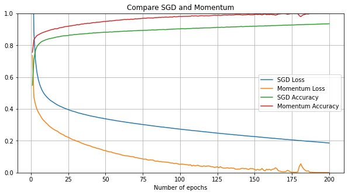

---
authors:
- admin
categories:
- Data Science
- Deep learning
date: "2020-06-14T00:00:00Z"
draft: false
featured: false
image:
  caption: ''
  focal_point: ""
  placement: 2
  preview_only: false
lastmod: "2020-06-14T00:00:00Z"
projects: []
subtitle: 'Improve deep neural network training speed and performance using Optimization'
summary: 'Speed up deep neural network training by tuning Optimizer in Tensorflow'
description: 'Speed up deep neural network training by tuning Optimizer in Tensorflow'
tags:
- Deep learning
- Data Science
- Optimization
- Hyperparameter tuning
- Tensorflow
title: 'Improve deep neural network training speed and performance with Optimization'
---

[Part 1: Initialization, Activation function and Batch Normalization/Gradient Clipping](https://geniusnhu.netlify.app/project/2020-05-30-speed-up-training-time-in-deep-neuron-net/)

**Part 2: Optimizer**

Training a deep neural network is an extremely time-consuming task especially with complex problems. Using a faster optimizer for the network is an efficient way to speed up the training speed, rather than simply using the regular Gradient Descent optimizer. Below, I will discuss and show training results/speed of 5 popular Optimizer approaches: **Gradient Descent with momentum and Nesterov Accelerated Gradient, AdaGrad, RMSProp, Adam, and Nadam optimizer**.

One of the dangers of using inappropriate optimizers is that the model takes a long time to converge to a global minimum or it will be stuck at a local minimum, resulting in a worse model. Therefore, knowing which Optimizer suits mostly on the problem will save you tons of training hours.
The main purpose of tuning Optimizer is to speed up the training speed but it also helps to improve the model's performance.

## 1. Gradient Descent

Computing the gradient of the associated cost function with regard to each theta and getting the gradient vector pointing uphill, then going in the opposite direction with the vector direction (downhill) using the below equation:

> $\theta_{next step} = \theta - \eta*  \nabla_{\theta}J(\theta)$
>
> $\theta$: weight of the model
>
> $\eta$: learning rate

Therefore, the speed of **Gradient Descent** optimizer depends solely on the learning rate parameter ($\eta$). With a small learning rate, GD will take small and unchanged steps downward on a gentle surface, and a bit faster steps on a steep surface. Consequently, in a large neural network, it repeats millions of slow steps until it reaches the global minimum (or gets lost in the local minimum). Therefore, the runtime becomes extremely slow.

Result of training with Fashion MNIST dataset using **SGD**:

<figure>
  
  <figcaption>Firgure 1: Loss and accuracy of model using SGD with learning rate 0.001</figcaption>
</figure>

The loss declined gradually and will be closer and closer to global minimum after several more epochs.

There are other versions of Gradient Descent such as **Batch Gradient Descent** (running on a full dataset), **Mini-batch Gradient Descent** (running on random subsets of a dataset), **Stochastic Gradient Descent - SGD** (picking a random instance at each step), and all have pros and cons. **Batch Gradient Descent** can reach the global minimum at a terribly slow pace. **Mini-batch Gradient Descent** gets to the global minimum faster than BGD but it is easier to get stuck in the local minimum, and **SGD** is usually harder to get to the global minimum compared to the other two.

## 2. Momentum Optimization
Let's imagine, when a ball rolls from the summit, downward the sloping side to the foot of the hill, it will start slowly then increase the speed as the momentum picks up and eventually reaches a fast pace toward the minimum. This is how **Momentum Optimization** works. This is enabled by adding a momentum vector m and update the theta parameter with this new weight from *momentum vector* $m$

> $m$ &leftarrow; $\beta m - \eta * \nabla_{\theta}J(\theta)$
>
> $\theta_{next step}$ &leftarrow; $\theta + m$

*Gradient descent* does not take into account the previous gradients. By adding the *momentum vector*, it updates the weight $m$ after each iteration. The momentum $\beta$ is the parameter controls how fast the terminal velocity is, which is typically set at 0.9 but it should be tuned from 0.5 to 0.99. As a result, **Momentum Optimizer** converges better and faster than *SGD*.

```python
# Implement Momentum optimizer in Tensorflow
optimizer=keras.optimizers.SGD(lr=0.001, momentum=0.99)
```
<figure>
  
  <figcaption>Figure 2: Loss and accuracy of models using SGD compared to momentum optimizer</figcaption>
</figure>

**Momentum** converges faster and eventually reaches a better result than *SGD*.

## 3. Nesterov Accelerated Gradient
Another variation of *Momentum Optimizer* is **Nesterov Accelerated Gradient - NAG**.

> $m$ &leftarrow; $\beta m - \eta * \nabla_{\theta}J(\theta + \beta m)$
> 
> $\theta_{next step}$ &leftarrow; $\theta + m$

The gradient of the cost function is measured at location $\theta + \beta m$ (instead of $\theta$ in the original momentum optimization). The reason behind this is that momentum optimization has already pointed toward the right direction, so we should use a slightly ahead location (an approximately next position of the $\theta$) to moderately accelerating the speed of convergence.

```python
# Implement Nesterov Accelerated Gradient optimizer in Tensorflow
optimizer=keras.optimizers.SGD(lr=0.001, momentum=0.9,nesterov=True
```
<figure>
  
  <figcaption>Figure 3: Loss and accuracy of models using momentum compared to Nesterov Accelerated Gradient optimizer</figcaption>
</figure>

**NAG** showed only a slightly better result than original *Momentum*.

## 4. AdaGrad
One of the *Adaptive learning rate methods*, in which the algorithm goes faster down the steep slopes than the gentle slopes.
**AdaGrad** performs well in a simple quadratic problem but not in training a neural network because it tends to slow down a bit too fast and stops before reaching the global minimum. Due to this drawback, I do not usually use **AdaGrad** for Neural Network but instead apply **RMSProp**, an alternative of **AdaGrad**.

## 5. RMSProp - Root Mean Square Prop
This is one of the most frequently used optimizers, which continues the idea of *Adagrad* in trying to minimize the vertical movement and updating the model in a horizontal direction toward the global minimum.

*Adagrad* sums the gradients from the first iteration and that is why it usually never converges to the global minimum, while **RMSProp** accumulates the gradients from the previous iterations:

> $s$ &leftarrow; $\beta s - (1-\beta) \nabla_{\theta}J(\theta)^2$
> 
> $\theta_{nextstep}$ &leftarrow; $\theta + \frac{\eta \nabla_{\theta}J(\theta)}{\sqrt{s + \epsilon}}$

$\beta$: decay rate, typically set at 0.9

$s$: exponential average square of past gradients

```python
# Implement RMSProp optimizer in Tensorflow
optimizer=keras.optimizers.RMSprop(lr=0.001, rho=0.9)
```
<figure>
  
  <figcaption>Figure 4: Loss and accuracy of models using RMSProp compared to Adagrad optimizer</figcaption>
</figure>

**RMSProp** converges better than *Adagrad* which is lost at a plateau.

## 6. Adam
**Adam optimizer** is the combination of *Momentum* and *RMSProp* optimizers. In other words, it takes into account both the exponential decay average of past gradients and the exponential decay average of past squared gradients.

With these characteristics, **Adam** is suitable for handling sparse gradients on complex problems with complex data and a large number of features.

> $m$ &leftarrow; $\beta_1 m - (1-\beta_1) \nabla_{\theta}J(\theta)$
> 
> $s$ &leftarrow; $\beta_2 s - (1-\beta_2) \nabla_{\theta}J(\theta)$
>
> $\hat{m}$ &leftarrow; $\frac{m}{1-\beta_1^T}$
>
> $\hat{s}$ &leftarrow; $\frac{s}{1-\beta_2^T}$
>
> $\theta_{nextstep}$ &leftarrow; $\theta + \frac{\eta \hat{m}}{\sqrt{\hat{s} + \epsilon}}$

$\eta$: learning rate

$s$: exponential average square of past gradients

$m$: momentum vector

$\beta_1$: momentum decay, typlically set at 0.9

$\beta_2$: scaling decay, typlically set at 0.999

$\epsilon$: smoothing term

```python
# Implement Adam optimizer in Tensorflow
optimizer=keras.optimizers.Adam(lr=0.001, beta_1=0.9, beta_2=0.999)
```
<figure>
  
  <figcaption>Figure 5: Loss and accuracy of models using Adagrad, RMSProp, and Adam</figcaption>
</figure>

## 7. Nadam
Another variation of *Adam* is **Nadam** (using *Adam optimizer with Nesterov technique*), resulting in a little faster training time than *Adam*.

```python
# Implement Nadam optimizer in Tensorflow
optimizer=keras.optimizers.Nadam(lr=0.001, beta_1=0.9, beta_2=0.999)
```
<figure>
  
  <figcaption>Figure 6: Loss and accuracy of models using RMSProp, Adam and Nadam</figcaption>
</figure>

**Adagrad, RMSProp, Ada, Nadam, and Adamax** are *Adaptive learning rate algorithms*, which require less tuning on hyperparameters. In case the performance of the model does not meet your expectation, you can try to change back to **Momentum optimizer** or **Nesterov Accelerated Gradient**.

# Final words :metal:

In conclusion, most of the time, *Adaptive learning rate algorithms* outperform *Gradient descent* and its variants in terms of speed, especially in a deep neural network. However, *Adaptive learning rate algorithms* do not ensure an absolute convergence to the global minimum.

If your model is not too complex with a small number of features, and training time is not your priority, using **Momentum**, **Nesterov Accelerated Gradient** or **SGD** is the optimal starting point, then tune the learning rate, activation functions, change Initialization technique to improve the model rather than using **Adaptive learning rate Optimizers** because the later ones hinder the risk of not converging to the global minimum.

<figure>
  
  <figcaption>Figure 7: Summary model performance on training loss of different optimization techniques</figcaption>
</figure>

* Regular SGD or regular Gradient Descent takes much more time to converge to the global minimum. Adagrad often stops too early before reaching the global minimum so in time it becomes the worse optimizer.
* With the Fashion MNIST dataset, Adam/Nadam eventually performs better than RMSProp and Momentum/Nesterov Accelerated Gradient. This depends on the model, usually, Nadam outperforms Adam but sometimes RMSProp gives the best performance.
* With my experience, I found out that Momentum, RMSProp, and Adam (or Nadam) should be the first try of the model.

## Summary

| Optimizer | Training speed | Converge quality | Note |
| ------ |:------:|:------------------:|:-------:|
| Gradient Descent / SGD | Medium for simple model<br>Slow for complex model | Good | Risk of converging to local minimum.<br>Can be controled by assigning the correct learning rate | 
| Momentum | Fast for simple model<br>Medium for complex model | Good | Suitable for less complex NN with small number of features<br>Need to consider tuning the momentum hyperparameter | 
| Nesterov Accelerated<br>Gradient | Fast for simple model<br>Medium for complex model | Good | Suitable for less complex NN with small number of features<br>Need to consider tuning the momentum hyperparameter | 
| AdaGrad | Fast | Usually miss global minimum<br>due to early stopping | Suitable for simple quadratic problem, not NN | 
| RMSProp | Fast | Acceptable | Suitable for complex NN<br>Need to tune Decay rate for better performance |
| Adam | Fast | Acceptable | Suitable for sparse gradients on complex model<br>with a large number of features |
| Nadam | Fast | Good | Suitable for sparse gradients on complex model<br>with a large number of features |

---

This article was originally published in [Towards Data Science](https://towardsdatascience.com/full-review-on-optimizing-neural-network-training-with-optimizer-9c1acc4dbe78)

Source code: [here](https://github.com/geniusnhu/DNN-Improvement/blob/master/Tuning_Optimizer.ipynb)