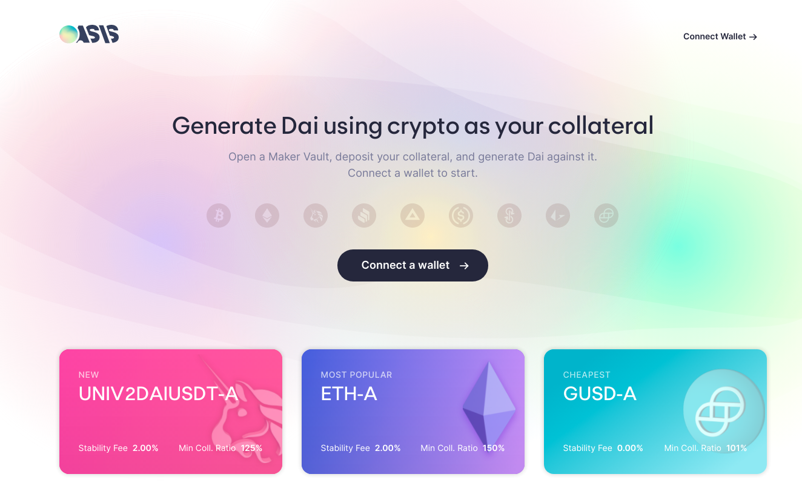
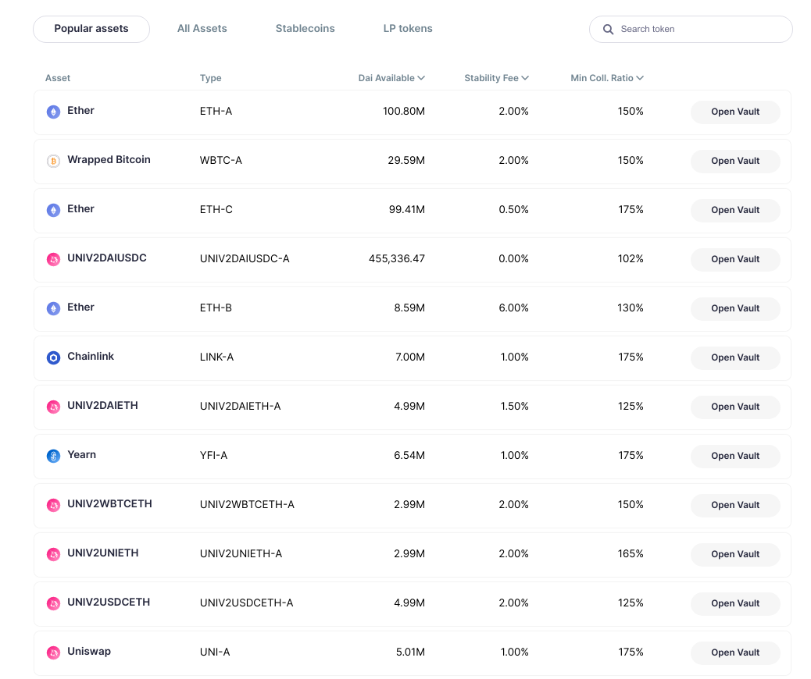

---
authors:
- admin
categories:
- Data Science
- Deep learning
date: "2021-07-30T00:00:00Z"
draft: false
featured: false
image:
  caption: ''
  focal_point: ""
  placement: 2
  preview_only: false
lastmod: "2020-07-30T00:00:00Z"
projects: []
subtitle: 'Monitor and tracking MakerDao status using Daistats statistics'
summary: 'Analyzing MakerDa statistics, one of the most popular DeFi protocol, seeds a light in DeFi market performance'
description: 'Crawling data from an open source page which tracking MakerDao vaults statistics and analyze these numbers for personal use'
tags:
- Data Science
- Project
- Data mining
title: 'Monitor MakerDao status using Daistats statistics'
---

[MakerDAO](https://oasis.app/) is one of the 3 largest Decentralized Finance platforms in crypto currency market, which has been received a lot of attention since 2020. Maker is the place where you can deposit collateral and loan DAI (1 DAI = 1 USD). 

In Maker, there are several types of vaults (loan plan in normal practice) in which accepts different cryptocurrencies and tokens as collateral. These vaults also vary in Stability Fee and Minimum collateral Ratio, which ranges from 102% to as high as 175%.

<figure>
  
  <figcaption>Firgure 1: Maker landing page</figcaption>
</figure>

<figure>
  
  <figcaption>Firgure 2: Different vaults in Maker (as of July 2021)</figcaption>
</figure>

Now, to the main topic of this post.

Given DAI is generated as collateral is backed in Maker vault, and the total market cap of DAI is more than **$5.5 Billion**, the movement of the DAI and the collateral in and out each vault tell a lot more stories than we expect. Therefore, several tracking websites and tools [link](https://github.com/makerdao/awesome-makerdao#analytics-and-metrics) for Maker, and one of the most useful one is [DaiStats](https://daistats.com/#/) . Personally, I prefer this page over others as it gives direct stats to each vault and provide other information such as amount of liquidation or auctions.

However, there is no tracking of historical data for the change corresponding to the vault throughout time, hence unable to determine the trend in overall of Maker. Thus, I created my own tracking website to observe the movement of the platform in term of Borrow.. Source of data is crawled directly from [DaiStats](https://daistats.com/#/) on a daily basis.

Here is the access link :

## [Maker tracking app](https://maker-dai-status.herokuapp.com/)
