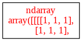
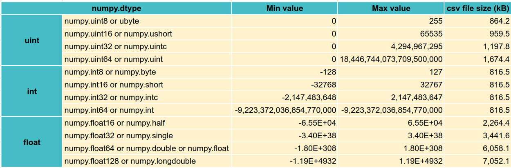
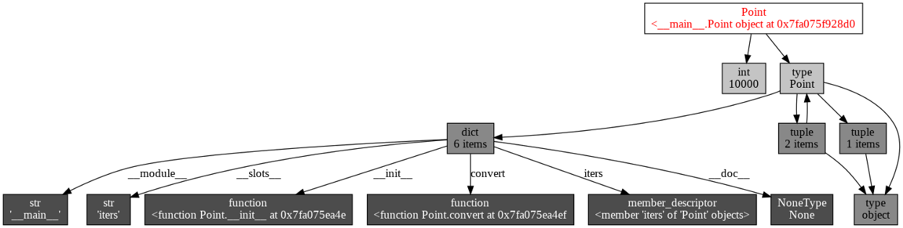
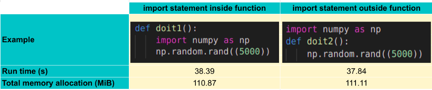

---
authors:
- admin
categories:
- Data Science
date: "2022-01-01T00:00:00Z"
draft: false
featured: false
image:
  caption: ''
  focal_point: ""
  placement: 2
  preview_only: false
lastmod: "2022-01-01T00:00:00Z"
projects: []
subtitle: 'Optimize Memory Effectively in Python'
summary: 'Tracking, managing, and optimizing memory usage in Python is a well-understood matter but lacks a comprehensive summary of methods. This post presents the most common and efficient approaches to enhance memory utilization'
description: 'Tracking, managing, and optimizing memory usage in Python is a well-understood matter but lacks a comprehensive summary of methods. This post presents the most common and efficient approaches to enhance memory utilization'
tags:
- Data Science
- Skill
title: 'Optimize Memory Tips in Python'
---

Memory management in Python is not a simple issue to solve, it requires a decent understanding of Python objects and data structures. Unlike in C/C++, users have no control over memory management. It is taken over by Python itself. However, with some insights about how Python works and memory support modules, we can somehow seed some light on how to control this issue.

---

## How much memory is being allocated?

There are several ways to get the size of an object in Python. You can use ```sys.getsizeof()``` to get the exact size of the object, ```objgraph.show_refs()``` to visualize the structure of an object or ```psutil.Process().memory_info().rss``` to get all memory is allocated at the moment.

```python

>>> import numpy as np
>>> import sys
>>> import objgraph
>>> import psutil
>>> import pandas as pd


>>> ob = np.ones((1024, 1024, 1024, 3), dtype=np.uint8)

### Check object 'ob' size
>>> sys.getsizeof(ob) / (1024 * 1024)
3072.0001373291016

### Check current memory usage of whole process (include ob and installed packages, ...)
>>> psutil.Process().memory_info().rss / (1024 * 1024)
3234.19140625

### Check structure of 'ob' (Useful for class object)
>>> objgraph.show_refs([ob], filename='sample-graph.png')

### Check memory for pandas.DataFrame
>>> from sklearn.datasets import load_boston
>>> data = load_boston()
>>> data = pd.DataFrame(data['data'])
>>> print(data.info(verbose=False, memory_usage='deep'))
<class 'pandas.core.frame.DataFrame'>
RangeIndex: 506 entries, 0 to 505
Columns: 13 entries, 0 to 12
dtypes: float64(13)
memory usage: 51.5 KB
  
### Check memory for pandas.Series
>>> data[0].memory_usage(deep=True)   # deep=True to include all the memory used by underlying parts that construct the pd.Series
4176

#### deep=True to include all the memory used by underlying parts that construct the pd.Series ###

```

<figure>
  
  <figcaption> Structure of ‘ob’ </figcaption>
</figure>

[tracemalloc](https://docs.python.org/3/library/tracemalloc.html) is also another choice. It is included in the Python standard library and provides block-level traces of memory allocation, statistics for the overall memory behavior of a program.

```python

>>> import tracemalloc
>>> import numpy as np

>>> def create_array(x, y):
>>>     x = x**2
>>>     y = y**3
>>>     return np.ones((x, y, 1024, 3), dtype=np.uint8)

>>> tracemalloc.start()
>>> ### Run application
>>> arr = create_array(30,10)
>>> ### take memory usage snapshot
>>> snapshot = tracemalloc.take_snapshot()
>>> top_stats = snapshot.statistics('lineno')

>>> ### Print top 10 files allocating the most memory
>>> print("[ Top 10 ]")
>>> for stat in top_stats[:10]:
>>>     print(stat)


[ Top 10 ]
/usr/local/lib/python3.7/dist-packages/numpy/core/numeric.py:192: size=2637 MiB, count=2, average=1318 MiB
/usr/lib/python3.7/threading.py:289: size=216 B, count=6, average=36 B
/usr/lib/python3.7/codeop.py:141: size=189 B, count=2, average=94 B
/usr/local/lib/python3.7/dist-packages/debugpy/_vendored/pydevd/pydevd.py:1532: size=144 B, count=2, average=72 B
/usr/local/lib/python3.7/dist-packages/IPython/core/interactiveshell.py:2820: size=112 B, count=3, average=37 B
/usr/lib/python3.7/queue.py:182: size=80 B, count=1, average=80 B
/usr/lib/python3.7/queue.py:107: size=80 B, count=1, average=80 B
/usr/lib/python3.7/threading.py:1264: size=72 B, count=1, average=72 B
    
## ==================================================================================
##### Explanation #####
## count: Number of memory blocks (int)
## size: Total size of memory blocks in bytes (int)
## traceback: Traceback where the memory block was allocated, Traceback instance

```

The most used file is the arr object which takes up 2 memory blocks with a total size of 2637 MiB. Other objects are minimal.

Another important technique is to estimate how much memory is needed for the process to run. This can be guessed through monitoring the peak memory usage of the process. To measure peak memory, you can use the below code at the end of the process.

```python

### For Linux (in KiB) and MacOS (in bytes)
from resource import getrusage, RUSAGE_SELF
print(getrusage(RUSAGE_SELF).ru_maxrss)
### For Windows
import psutil
print(psutil.Process().memory_info().peak_wset)

```

Having the peak number and the amount of data put in the process, you can, by some means, judge the amount of memory to be consumed for your next process.

---

# Optimize memory

## 1. Utilize Pytorch DataLoader

Training a large dataset is a bottleneck for your memory and you will never be able to train a complete model given the whole dataset never fits in your memory at the same time, especially for unstructured data such as image, text, voice,… However, with Pytorch DataLoader, you manage to set up various mini-batches for the whole dataset and each is loaded uninterruptedly into your model (the number of samples depends on your memory capability). You can see [here](https://pytorch.org/tutorials/beginner/data_loading_tutorial.html) the tutorial on using Pytorch DataLoader.

However, if you want to train a Machine Learning model on tabular data without using Deep learning (hence, not using Pytorch) or you don’t have access to a Database and have to work solely on the memory, what will be the choice for memory optimization?

## 2. Optimized data type

By understanding how data is stored and manipulated and using the optimal data type for the tasks, it will save you huge space in memory and computation time. In Numpy, there are multiple types, including boolean (bool), integer (int), Unsigned integer (uint), float, complex, datetime64, timedelta64, object_, etc…

```python

### Check numpy integer
>>> import numpy as np
>>> ii16 = np.iinfo(np.int16)
>>> ii16
iinfo(min=-32768, max=32767, dtype=int16)
### Access min value
>>> ii16.min
-32768

```

I narrow them down to **uint, int, and float** given these are the most common when training models, handling data in Python. Depending on different needs and objectives, using sufficient data types becomes vital know-how. To check type minimum and maximum values, you can use function ```numpy.iinfo()```, ```and numpy.finfo()``` for float.

Below is the summary information for each type.

<figure>
  
  <figcaption>  </figcaption>
</figure>

The CSV file size doubles if the data type is converted to ```numpy.float64```, which is the default type of numpy.array, compared to ```numpy.float32```. Therefore, **float32** is one of the optimal ones to use (Pytorch datatype is also **float32**).

As the default data type ```numpy.float()``` is **float64** and ```numpy.int()``` is **int64**, remember to define the dtype when creating numpy array will save a huge amount of memory space.

When working with DataFrame, there will be another usual type which is **“object”**. Converting from object to category for feature having various repetitions will help computation time faster.

Below is an example function to optimize the pd.DataFrame data type for scalars and strings.

```python

def data_optimize(df, object_option=False):
    """Reduce the size of the input dataframe
    Parameters
    ----------
    df: pd.DataFrame
        input DataFrame
    object_option : bool, default=False
        if true, try to convert object to category
    Returns
    -------
    df: pd.DataFrame
        data type optimized output dataframe
    """

    # loop columns in the dataframe to downcast the dtype
    for col in df.columns:
        # process the int columns
        if df[col].dtype == 'int':
            col_min = df[col].min()
            col_max = df[col].max()
            # if all are non-negative, change to uint
            if col_min >= 0:
                if col_max < np.iinfo(np.uint8).max:
                    df[col] = df[col].astype(np.uint8)
                elif col_max < np.iinfo(np.uint16).max:
                    df[col] = df[col].astype(np.uint16)
                elif col_max < np.iinfo(np.uint32).max:
                    df[col] = df[col].astype(np.uint32)
                else:
                    df[col] = df[col]
            else:
                # if it has negative values, downcast based on the min and max
                if col_max < np.iinfo(np.int8).max and col_min > np.iinfo(np.int8).min:
                    df[col] = df[col].astype(np.int8)
                elif col_max < np.iinfo(np.int16).max and col_min > np.iinfo(np.int16).min:
                    df[col] = df[col].astype(np.int16)
                elif col_max < np.iinfo(np.int32).max and col_min > np.iinfo(np.int32).min:
                    df[col] = df[col].astype(np.int32)
                else:
                    df[col] = df[col]
                    
        # process the float columns
        elif df[col].dtype == 'float':
            col_min = df[col].min()
            col_max = df[col].max()
            # downcast based on the min and max
            if col_min > np.finfo(np.float32).min and col_max < np.finfo(np.float32).max:
                df[col] = df[col].astype(np.float32)
            else:
                df[col] = df[col]

        if object_option:
            if df[col].dtype == 'object':
                if len(df[col].value_counts()) < 0.5 * df.shape[0]:
                    df[col] = df[col].astype('category')

    return df

```

Another way to easily and efficiently reduce ```pd.DataFrame``` memory footprint is to import data with specific columns using ```usercols``` parameters in ```pd.read_csv()```

## 3. Avoid using global variables, instead utilize local objects

Python is faster at retrieving a local variable than a global one. Moreover, declaring too many variables as global leads to Out of Memory issue as these remain in the memory till program execution is completed while local variables are deleted as soon as the function is over and release the memory space which it occupies. Read more at [The real-life skill set that data scientists must master](https://towardsdatascience.com/the-real-life-skill-set-that-data-scientists-must-master-8746876d5b2e)

## 4. Use yield keyword

Python yield returns a generator object, which converts the expression given into a generator function. To get the values of the object, it has to be iterated to read the values given to the yield. To read the generator’s values, you can use ```list()```, for loop, or ```next()```.

```python

>>> def say_hello():
>>>    yield "HELLO!"
>>> SENTENCE = say_hello()
>>> print(next(SENTENCE))
HELLO!

```

However, generators are for one-time use objects. If you access it the second time, it returns empty.

```python

>>> def say_hello():
>>>    yield "HELLO!"
>>> SENTENCE = say_hello()
>>> print(next(SENTENCE))
HELLO!
>>> print("calling the generator again: ", list(SENTENCE))
calling the generator again: []

```

As there is no value returned unless the generator object is iterated, no memory is used when the Yield function is defined, while calling Return in a function leads to the allocation in memory.

Hence, **Yield** is suitable for large dataset, or when you don’t need to store all the output values but just one value for each iteration of the main function.

```python

>>> import sys
>>> my_generator_list = (i*2 for i in range(100000))
>>> print(f"My generator is {sys.getsizeof(my_generator_list)} bytes")
My generator is 128 bytes
>>> timeit(my_generator_list)
10000000 loops, best of 5: 32 ns per loop
  
>>> my_list = [i*2 for i in range(1000000)]
>>> print(f"My list is {sys.getsizeof(my_list)} bytes")
My list is 824472 bytes
>>> timeit(my_list)
10000000 loops, best of 5: 34.5 ns per loop

```
Looking at the above code, the list comprehension is 6441 times heavier than the generator and runs slower than the other generator.


## 5. Built-in Optimizing methods of Python

Use Python Built-in Functions to improve code performance. Check the [list](https://docs.python.org/3/library/functions.html) of functions.

### Utilize __slots__ in defining class

Python class objects’ attributes are stored in the form of a dictionary. Thus, defining thousands of objects is the same as allocating thousands of dictionaries to the memory space. And adding ```__slots__``` (which reduces the wastage of space and speeds up the program by allocating space for a fixed amount of attributes.)

```python

import numpy as np
import pandas as pd
import objgraph

### class without __slots__
class PointWithDict():
    def __init__(self, iters):
        self.iters = iters
    def convert(self):
        s = ["xyz"]*self.iters
        s = "".join(s)
        assert len(s) == 3*iters
        
w_dict = PointWithDict(10000)
objgraph.show_refs([w_dict], filename='PointWithDict_structure.png')

### class using __slots__
class PointWithSlots():
    __slots__ = "iters"
    def __init__(self, iters):
        self.iters = iters
    def convert(self):
        s = ["xyz"]*self.iters
        s = "".join(s)
        assert len(s) == 3*iters
        
w_slots = PointWithSlots(10000)
objgraph.show_refs([w_slots],filename='PointWithSlots_structure.png')

### Check memory footprint
>>> print(sys.getsizeof(w_dict), sys.getsizeof(w_dict.__weakref__), sys.getsizeof(w_dict.__dict__))
64 16 120
>>> print(sys.getsizeof(ob))
56

```

<figure>
  
  <figcaption> Structure of Point module without __slots__  </figcaption>
</figure>


<figure>
  
  <figcaption> Structure of Point module with __slots__, there is no __dict__ anymore </figcaption>
</figure>

Regarding memory usage, given there is no longer ```__dict__``` in a class object, the memory space reduces noticeably from (64+16+120)=200 to 56 bytes.

### Use join() instead of ‘+’ to concatenate string

As strings are immutable, every time you add an element to a string by the “+” operator, a new string will be allocated in memory space. The longer the string, the more memory consumed, the less efficient the code becomes. Using ```join()``` can improve speed >30% vs ‘+’ operator.

```python

### Concatenate string using '+' operation
def add_string_with_plus(iters):
    s = ""
    for i in range(iters):
        s += "abc"
    assert len(s) == 3*iters
    
### Concatenate strings using join() function
def add_string_with_join(iters):
    l = []
    for i in range(iters):
        l.append("abc")
    s = "".join(l)
    assert len(s) == 3*iters
    
### Compare speed
>>> timeit(add_string_with_plus(10000))
100 loops, best of 5: 3.74 ms per loop
>>> timeit(add_string_with_join(10000))
100 loops, best of 5: 2.3 ms per loop

```


There are other methods to improve speed and save memory, check details [here](https://wiki.python.org/moin/PythonSpeed).

### itertools

```python
import numpy as np
import itertools
import sys

def append_matrix_with_itertools(X, Y):
  
    """ Loop matrix using itertools.product()
    """
    
    MTX = np.zeros((X, Y))
    for i, j in itertools.product(range(X), range(Y)):
        if (i%2==0) & (i%3==1):
            MTX[i, j] = i**2/10
            
    return MTX

def append_matrix_with_loop(X, Y):
  
    """ Loop matrix using normal for loop
    """
    
     MTX = np.zeros((X, Y))
    for i in range(X):
        for j in range(Y):
            if (i%2==0) & (i%3==1):
                MTX[i, j] = i**2/10
    return MTX


>>> MTX_itertools = append_matrix_with_itertools(MTX.shape[0], MTX.shape[1])
>>> MTX_loop = append_matrix_with_loop(MTX.shape[0], MTX.shape[1])

### Matrix size
>>> print(sys.getsizeof(MTX_itertools)/ (1024 * 1024))
>>> print(sys.getsizeof(MTX_loop)/ (1024 * 1024))
7.6295013427734375
7.6295013427734375

### Run time
>>> timeit(append_matrix_with_itertools(1000, 1000))
1 loop, best of 5: 234 ms per loop
>>> timeit(append_matrix_with_loop(1000, 1000))
1 loop, best of 5: 347 ms per loop

```

Or flatten a list with ```itertools.chain()```

```python

### Concatenate string using '+' operation
def add_string_with_plus(iters):
    s = ""
    for i in range(iters):
        s += "abc"
    assert len(s) == 3*iters
    
### Concatenate strings using join() function
def add_string_with_join(iters):
    l = []
    for i in range(iters):
        l.append("abc")
    s = "".join(l)
    assert len(s) == 3*iters
    
### Compare speed
>>> timeit(add_string_with_plus(10000))
100 loops, best of 5: 3.74 ms per loop
>>> timeit(add_string_with_join(10000))
100 loops, best of 5: 2.3 ms per loop

```

Check out [itertools documentation](https://docs.python.org/3/library/itertools.html#module-itertools) for more methods. I recommend exploring:

* ```itertools.accumulate(iterable , func)```: accumulate through iterable. func can be an operator.func or default Python functions such as max, min…

* ```itertools.compress(iterable, selectors)```: filters the iterable with another (the other object can be treated as a condition)

* ```itertools.filterfalse(predicate, iterable)```: filter and drop values that satisfy the predicate. This is useful and fast for filtering a list object.

* ```itertools.repeat(object[, times])```: repeat a object value N times. However, I prefer using list multiplication ```['hi']*1000``` to repeat ‘hi’ 1000 times than using ```itertools.repeat('hi', 1000)``` (12.2 µs per loop vs 162 µs per loop respectively)

* ```itertools.zip_longest(*iterables, fillvalue=None)```: zip multiple iterables into tuples and fill None value with the value specified in fillvalue.

## 6. Import Statement Overhead

```import``` statement can be executed from anywhere. However, executing outside of a function will run much faster than the inside one, even though the package is declared as a global variable (doit2), but in return, takes up more memory space than the other one.

<figure>
  
  <figcaption> Comparison of import execution position </figcaption>
</figure>

## 7. Data chunk

I’m confident to say that most of the time you don’t use all of your data all at once and loading them in 1 big batch may crash the memory. Therefore, chunking data or load in small chunks, process the chunk of data, and save the result is one of the most useful techniques to prevent memory error.

pandas lets you do that with the help of ```chunksize``` or ```iterator``` parameters in ```pandas.read_csv()``` and ```pandas.read_sql()```. sklearn also supports training in small chunks with ```partial_fit()``` method for most models.

```python

>>> from sklearn.linear_model import SGDRegressor
>>> from sklearn.datasets import make_regression
>>> import numpy as np
>>> import pandas as pd

>>> ### Load original data
>>> original_data = pd.read_csv('sample.csv')
>>> print(f'Shape of original data {original_data.shape:.f02}')
Shape of original data (100000, 21)


>>> ### Load in chunk
>>> chunksize = 1000
>>> reg = SGDRegressor()
>>> features_columns = [str(i) for i in range(20)]

>>> ### Fit each chunk
>>> for train_df in pd.read_csv("sample.csv", chunksize=chunksize, iterator=True):
>>>     X = train_df[features_columns]
>>>     Y = train_df["target"]
>>>     reg.partial_fit(X, Y)

### The reg.partial_fit() method fit each chunk at a time and update weights accordingly after each the next chunk is loaded 

```

---

# Take-aways 📖

Handling Memory Error in Python is a tricky task and the root cause might be never been detected if you go another way around.

* First, investigate which process/variable is the core reason leading to the memory overflown problem.
Second, apply the applicable memory optimization methods for that object, estimate the new memory footprint and examine if the new one solves the issue.

* If not, try to optimize related processes (such as reducing whole process memory consumption to save more space for the core object).

* Try the above tips and if the trouble remains, consider building the process with chunk/batch operation with the support of an outside database service.

