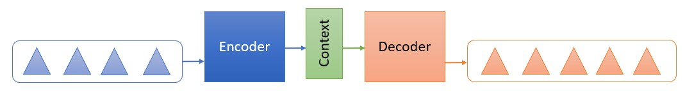
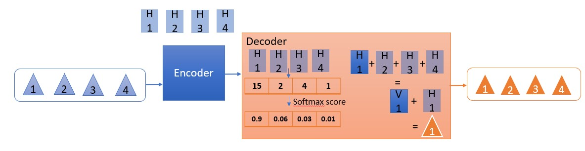

---
authors:
- admin
categories:
- Machine Learning
- NLP
date: "2020-02-12T00:00:00Z"
draft: false
featured: false
image:
  caption: 'Image Credit: raindrop74 / Shutterstock'
  focal_point: ""
  placement: 2
  preview_only: false
lastmod: "2020-02-12T00:00:00Z"
projects: []
subtitle: 'What is Transformer in today NLP outlook and how does Natural Language Processing contribute to our life'
summary: 'What is Transformer in today NLP outlook and how does Natural Language Processing contribute to our life'
tags:
- NLP
- Data Science
- Machine learning
- Concept
- Application
title: 'The beauty of Transformer in bringing more applications to life'
---

My 2020 started awesomely with a Machine Learning Forum @Google Japan and followed with 2 Meetups about Natural Language Processing application. NLP has been the focus of the Machine Learning society for the last decade and it is reaching to its ultimate point with several outbreak of innovations and application. 

At this moment, 2020, NLP is heading towards **speed and big data**, which means that the increasing of the speed and size of data is the key objective of future NLP innovations. At the moment, I am impressed with **BERT - Bidirectional Encoder Representations from Transformers**, a powerful state-of-the-art NPL model introduced by Google in 2018; and ***Google Meena**, a lift toward dealing with big-NLP database using the Transformer base introducted on Jan 28, 2020.

### 1.	Why are BERT and Transformer being called the revolution of the NLP world?

To understand **Transformer model** inclduing BERT, we need to take a look of the progress from **Seq2Seq (sequence to sequence)** and its evolution to attention and to BERT.

#### 1.1 Seq2Seq model:

In NLP, the end that a machine is expected to understand is the meaning of the sentence, not only word by word. **Seq2Seq** is a technique to train the machine in which it takes a sequence of an item and generates another sequence as output. 

Within the model, there contains **Encoder** and **Decoder**. The **Encoder** receives the original text and convert the text into a **Context vector** that the Machine can read. Then, the **Decoder** does the job of generating a new sequence of items based on the **Context vector**. 

In Seq2Seq, a sentence does not need to go through both Encoder and Decoder, it can stop at Encoder. Some example of Encoder only is the suggested word *"message"* after you type *"Thank you for your"*.

**Context** or **Context vector** is a vector of floats representing the input sequence. **"Word Embedding"** is the algorithm used to transform text into vector, and the size of vector is usually 265, 512 or 1024 dimensions.

     
#### 1.2 Attention

One of the disadvantages of Context in Seq2Seq is the **dealing with long sentences and handling the sequence of output**. Context is generated by the Word embedding algorithm and the longer the sentence or the paragraph, the bigger the size of vector and the more memory consuming. 

Moreover, the context in Seq2Seq **was not built to figure out the similarity between words** because it does not focus on the **relevancy of the words in the sentence**. This leads to the issue that a sentence in English cannot be translated correctly to Japanese which has the reserve order in sentence structure.

The concept of Attention was introduced in [Bahdanau et al., 2014](https://arxiv.org/abs/1409.0473) and [Luong et al., 2015](https://arxiv.org/abs/1508.04025) in which it takes into account the relevant parts in the sentence. 

Instead of passing the last hidden state to the **Decoder**, the Attention model **passes all the hidden states to the Decoder** with the summary process as below: 
1. Give each hidden state a score 
2. Use **Softmax function** to multiply each hidden state. This brings about high Hidden state scores and low hidden state scores or in other word, it generates the probability of each hidden state associating with the input word. 
3. The **Decoder** will sum up all the weighted softmax Hidden state vectors into a context vector and concatenate it with its original hidden state vector.

     
The advantage of this model is the capability to **choose the decoding word based on the probability of that word in associating with the original input without losing the sequential characteristics of the sentence**. This has high effectiveness in dealing with translating of common words such as "the", "his", "of", etc. and the sequence of different languages.

#### 1.3 Transformer:

**Transformer** is built on the foundation of **Attention** model. Therefore, **Transformer** can deal with the relevancy of the sentence rather than converting from word to word in **Seq2Seq**.

The biggest difference of **Transformer** vs **Seq2Seq** is that instead of generating 1 vector from **Encoder**, **Transformer** model uses 3 vectors in order to decide which other parts of the sentence are important (or unimportant) to that word. 

The below table show more details of the calculation.

| Word | Q vector | K vector | V vector | Score |   Softmax   |     Sum     |
| ---- |:--------:|:--------:|:--------:|:-----:|:-----------:|:-----------:|
| **First word**                                                            |
| I    | Q1       | K1       | V1       | Q1xK1 |S1=Q1xK1/8xV1|             |
| love |          | K2       | V2       | Q1xK2 |S2=Q1xK2/8xV2|Z1 = S1+S2+S3|
| data |          | K3       | V3       | Q1xK3 |S3=Q1xK3/8xV3|             |
|      |          |          |          |       |             |             |
| **Second word**                                                           |
| I    |          | K1       | V1       | Q2xK1 |S1=Q2xK1/8xV1|             |
| love | Q2       | K2       | V2       | Q2xK2 |S2=Q2xK2/8xV2|Z2 = S1+S2+S3|
| data |          | K3       | V3       | Q2xK3 |S3=Q2xK3/8xV3|             |
|      |          |          |          |       |             |             |
| **Third word**                                                            |
| I    |          | K1       | V1       | Q3xK1 |S1=Q3xK1/8xV1|             |
| love |          | K2       | V2       | Q3xK2 |S2=Q3xK2/8xV2|Z3 = S1+S2+S3|
| data | Q3       | K3       | V3       | Q3xK3 |S3=Q3xK3/8xV3|             |

>One example of this model application is the suggestion of relevant words when typing sentence. Gmail can suggest **"message", "reply", "call"** at the same time based on the typed sentence **"Thank you for your**".

This is a brief introduction on the transition from Seq2Seq to Transformer and how the **Transformer model** outstands **Seq2Seq** at the moment. 

### 2. Business Applications of NLP

-	**Chatbot**: This is obviously the forefront application of NLP, which can be seen across all industries and companies. Given its popularity, there are several tools to support building a chatbot such as Google DialogFlow, Microsoft LUIS. These tools can be customized based on the user's needs; however, they can only deal with simple requests. 

-	**Machine translation**: such as Google translate or pocket translator device.

-	**Search engine**: 5 years ago, when you searched something on search engine, whether you type key words "to Tokyo" or the whole sentences "How to go to Tokyo", the machine would generate quite similar results. However, with the evolution of BERT and Transformer, searching the whole sentence will throw you to a better search result.

-	**Monitoring of brand and product - Sentiment analysis:** This is the field that I used to analyze during my first job. I used sentiment analysis on big scale online platforms including online forums, social network, brand website and e-commerce sites to understand the reaction of consumers toward a campaign or a brand in order to react promptly toward negative trend related to the brand.

-	**Place to display an advertisement**: display ads based on context or categorization and make sure that the article is appropriate at the placing place. Honestly saying, I have not seen much of this application around.

-	**Remarketing**: an online advertisement based on the browsing history of a user to target them with similar advertising product to drive them back the previous interest. This personalized application is a very effective tool in today online market in which thousands of sellers trying to attract each of their customers. Youtube, Facebook or Google are the biggest applicators.

-	**Medical assistant**: although called "assistant", the major task of this service is to transcript the discussion between doctors and patients.

-	**Text generation**: this is one of the applications of Decoding in NLP, in which the machine will generate a complete article from what it was learnt or summarize a paragraph. As you may know, there are many contradictions about this application, especially the emergence of fake news in recent years. With the completion of this technology, whether the fake news issue continues its expansion or is stopped is still a big question.

-	**Information extraction**: extract dynamic required information that is sleeping in the database system.

-	**Resume reviews**: use NLP to scan the applicants' resume to figure out potential candidate for the interview. This application sticks with Amazon big scandal. Amazon used to use this to scan the resume which led to the inequality between male and female with the result preferred male than female. This is due to 0the bias toward male in the training set of the model.

-	**Voice command**: an emerging technology in recent years with the appearance of smart device such as Siri in Iphone, Alexa of Amazone, Google home or Cortana of Microsoft. 

Beside the major technological trends mentioned above, the application trend is heading toward diversity in languages and translation efficacy. Moreover, not only applying NLP alone, there are more applications combining NLP and Voice recognition or Computer Vision. 

NLP is a powerful Machine Learning area and its application is supporting human's life even more than we can expect. Therefore, NLP is one of the most used Machine Learning fields by Data Scienctist.