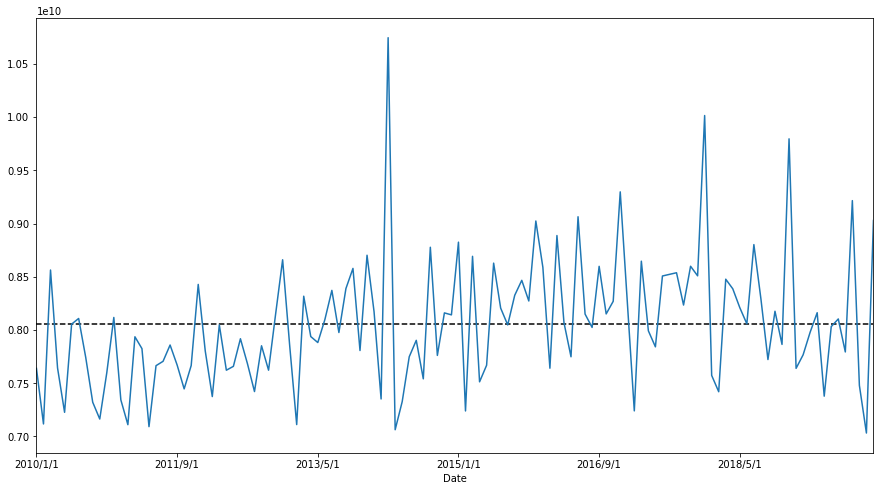
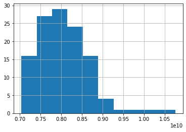
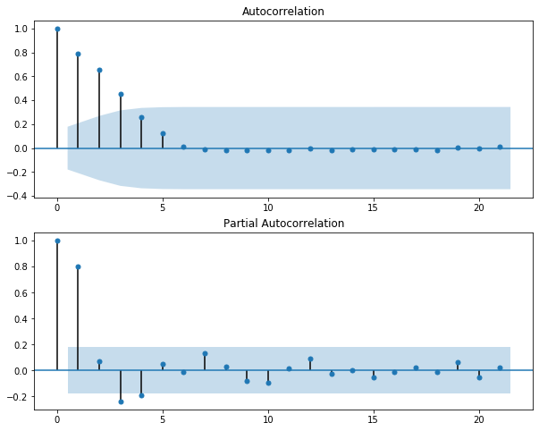

---
authors:
- admin
categories:
- Data Science
- Forecasting
- ARIMA
date: "2020-01-26T00:00:00Z"
draft: false
featured: false
image:
  caption: ''
  focal_point: ""
  placement: 2
  preview_only: false
lastmod: "2020-03-06T00:00:00Z"
projects: []
subtitle: 'ARIMA Autoregressive Integrated Moving Average model'
summary: 'Comprehensive summary of ARIMA model and how to apply it to forecasting'
tags:
- Data Science
- Forecasting
- ARIMA
title: 'ARIMA Autoregressive Integrated Moving Average model family'
---

## 1.	Concept Introduction

Auto Regressive Integrated Moving Average: 'explains' a given time series based on its own past values. ARIMA is expressed as $ARIMA(p,d,q)$

The evolution of ARIMA started with the model ARMA or Auto Regressive Moving Average. However, this model does not include the **Integrated term**, or differencing order (I'll talk about this later on) so this model can only be used with **Stationary data**. For **non-stationary data**, we will use ARIMA.

There are 3 parts in the ARIMA model: **Auto Regressive (AR)** $p$, **Integrated (I)** $d$, **Moving Average (MA)** $q$

*	**Integrated** (Or stationary): A time series which needs to be differenced to become stationary is the *integrated* version of stationary series. One of the characteristics of Stationary is that the effect of an observation dissipated as time goes on. Therefore, the best long-term predictions for data that has stationary is the historical mean of the series.

*	**Auto Regressive**: is simply defined a the linear or non-linear model between current value of the series with its previous values (so called **lags**), and there are unlimited number of lags in the model. The basic assumption of this model is that the current series value depends on its previous values. This is the long memory model because the effect slowly dissipates across time. p is preferred as the maximum lag of the data series.
   The AR can be denoted as
$Y_{t}=\omega_{0}+\alpha_{1}Y_{t-1}+\alpha_{2}Y_{t-2}+...+\xi$

*	**Moving Average**: deal with 'shock' or error in the model, or how abnormal your current value is compared to the previous values (has some residual effect).
   The MA is denoted as
$Y_{t}=m_1\xi_{t-1}+\xi_t$


$p$, $d$, and $q$ are non-negative integers; 
*	$p$: The number of **Autoregressive terms**. **Autoregressive term** is the lag of the staionarized series in the forecasting equation.
*	$d$: the degree of differencing (the number of times the data have had past values subtracted). 
*	$q$: the order of the moving-average terms (The size of the moving average window) or in order word, the lag of the forecast errors

A value of 0 can be used for a parameter, which indicates to not use that element of the model. When two out of the three parameters are zeros, the model may be referred to non-zero parameter. For example, $ARIMA (1,0,0)$ is $AR(1)$  (i.e. the ARIMA model is configured to perform the function if a AR model), $ARIMA(0,1,0)$ is $I(1)$, and $ARIMA(0,0,1)$ is $MA(1)$

## 2. Is the data predictable?

One of the key important thing to define before fitting ro forecast any sets of data is confirm whether the data is **predictable** or it is just a **"Random Walk"**.

**Random walk** means the movement of the data is random and cannot be detected. The **Random Walk** is denoted as $ARIMA(0,1,0)$. If the data is not stationary, Random walk is the simplest model to fit

The forecasting equation for Random Walk is:

$\hat{Y_{t}}-Y_{t-1}=\mu$

In other word, **Random walk** is the $AR(1)$ model with coefficient $\beta_1=0$.

Therefore, to test this hypothesis, we use hypothesis testing with *null hypothesis* $H_0 = 1$ vs. $H_1 \neq 1 $. The $AR(1)$ model is fitted to the data and we examine the coefficient. If the coefficient is statistically significantly different than 1, we can conclude that the data is predictable and vice versa.

Let't work with some data.
```python
plt.figure(figsize=(15,8));
data.plot()
```

     
Distribution


     
These plots show a high probability that the data is not **Stationary**. 

On the other hand, this data shows a seasonlity trend so instead of ARIMA, wI will use SARIMA, another seasonal-detected ARIMA model.

SARIMA is denoted as $SARIMA(p,d,q)(P,D,Q)m$

## 3. Confirm the data's Stationarity
It is essential to confirm the data to be stationary or not because this impacts directly to your model selection for the highest accuracy.

There are several methods to examine the data. One of the most statistical accurate way is the **Augmented Dicky-Fuller** method in which it tests the data with 2 hypothesis. The **Null hypothesis** is not staionary and the **alternative hypothese** is stationary.

```python
# Run test
series = data.values
result = adfuller(data)
print('ADF Statistic: %f' % result[0])
print('p-value: %f' % result[1])
print('Critical Values:')
for key, value in result[4].items():
	print('\t%s: %.3f' % (key, value))
```
```
ADF Statistic: -1.557214
p-value: 0.505043
Critical Values:
	1%: -3.492
	5%: -2.889
	10%: -2.581
```

p-value is higher than 0.05 so we fail to reject the Null hypothesis which means the data is stationary.

## 4. Differencing the data
Differencing is the methid to stationarize the time series data.

There is quite a clear 3-month seasonality with this data so I'll conduct 3 month seasonaliry differencing.

```python
# Difference the orginal sales data
plt.figure(figsize=(15,8));
train_diff_seasonal = train - train.shift(3)
plt.plot(train_diff_seasonal)

# Conduct the test
series = train_diff_seasonal.dropna().values
result = adfuller(series)
print('ADF Statistic: %f' % result[0])
print('p-value: %f' % result[1])
print('Critical Values:')
for key, value in result[4].items():
	print('\t%s: %.3f' % (key, value))
```

```
ADF Statistic: -3.481334
p-value: 0.008480
Critical Values:
	1%: -3.529
	5%: -2.904
	10%: -2.590
```


The data became stationary with p-value of the test is less than 0.05.
Let's examine ACF and PACF of the data

```python
# Split train, validation and test sets
train = data[:84]
validation = data[84:108]
test = data[108:]

# ACF and PACF for orginal data
series=train.dropna()
fig, ax = plt.subplots(2,1, figsize=(10,8))
fig = sm.graphics.tsa.plot_acf(series, lags=None, ax=ax[0])
fig = sm.graphics.tsa.plot_pacf(series, lags=None, ax=ax[1])
plt.show()
```


**Some observation**

With the p-value from the test is now significantly lower than 0.05, and the number of significantly peaks in ACF has dropped, the data has become stationary.
Let's set the parameters for SARIMA
- $p$ is most probably 3 as this is the last significant lag on the PACF.
- $d$ should equal 0 as we do not have differencing (only seasonal differencing and this will be reflected later on)
- $q$ should be around 3
- $P$ should be 2 as 3th, and 9th lags are somewhat significant on the PACF
- $D$ should be 1 as we performed seasonal differencing
- $Q$ is probably 2 as the 3th lag and 9th lag are significant in ACF plot while other 6th and 9th lags are not.

Let't assign parameter and do grid search on which comnbination is optimum

```python
ps = range(3,5)
d= 0
qs = range(2,5)
Ps= range(1,4)
D=1
Qs=range(0,3)
s=6 # annual seasonality

parameters = product(ps,qs,Ps, Qs)
parameters_list = list(parameters)
result_table = optimizeSARIMA(parameters_list, d, D, s)

# set the parameters that give the lowest AIC
p, q, P, Q = result_table.parameters[0]

best_model=sm.tsa.statespace.SARIMAX(data, order=(p, d, q),
                                     seasonal_order=(P, D, Q, zs)).fit(disp=-1)
print(best_model.summary())

# Examine the residuals
# ACF and PACF for orginal data
plt.plot(best_model.resid)

fig, ax = plt.subplots(2,1, figsize=(10,8))
fig = sm.graphics.tsa.plot_acf(best_model.resid, lags=None, ax=ax[0])
fig = sm.graphics.tsa.plot_pacf(best_model.resid, lags=None, ax=ax[1])

plt.show()
```


Lag-1 of the residual in PACF still shows the sign of autocorrelation which implies that it needs more adjustment with the model.

## 5. Model evaluation

There are 2 common measures to evaluate the predicted values with the validation set.

**1.	Mean Absolute Error (MAE):**
...How far your predicted term to the real value on absolute term. One of the drawbacks of the MAE is because it shows the absolute value so there is no strong evidence and comparison on which the predicted value is actually lower or higher. 

$MAE=\frac{1}{n}\sum_{i = 1}^{n} |Y_{t}-\hat{Y_{t}}|$

can be run with R
```r
mean(abs(Yp - Yv))
```

or in Python
```python
from sklearn import metrics
metrics.mean_absolute_error(y_test, y_pred)
```

**2. Mean absolute percentage error (MAPE):**

The MAE score shows the absolute value and it is hardly to define whether that number is good or bad, close or far from expectation. This is when MAPE comes in.

MAPE measures how far your predicted term to the real value on absolute percentage term.

$MAPE=100\frac{1}{n}\sum_{i = 1}^{n} \frac{|Y_t-\hat{Y_t}|} {\hat{Y_{t}}}$

Can compute as
```
100 x mean(abs(Yp - Yv) / Yv )
```
