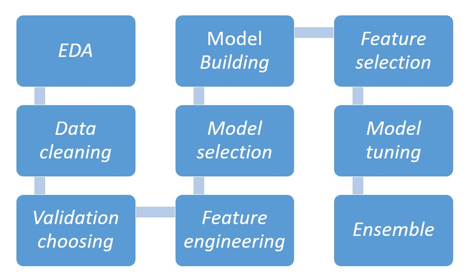

---
authors:
- admin
categories:
- Data Science
date: "2020-01-26T00:00:00Z"
draft: false
featured: false
image:
  caption: ''
  focal_point: ""
  placement: 2
  preview_only: false
lastmod: "2020-01-26T00:00:00Z"
projects: []
subtitle: 'How does a valuable Data Scientist look like?'
summary: Overcome Data Scientist bottle neck in conducting a Data Science Project in real business context to become a valuable employee'
tags:
- Process
- Business
title: 'Practical flow of a Data Science Project'
---

**Have you ever wondered why you, a talented Data Scientist, is not considered as an adviser or a consultant for business, but just a normal employee?**

This is such a common complaint I heard so many times from my friends, especially the junior. I have also struggled with this issue during the first year of my career but then I successfully overcame it. Now, I realized that this is a real **bottleneck** of Data Scientist and I think I should share my experience to others so that it will help other Data Scientist achieving a higher reputation for their career. 

This problem does not only exist in some certain areas but appears everywhere, especially when the scale is tilted toward technical skills rather than keeping balance between **business mindset** and **technical models**.

Even for some senior Data Scientists, this issue is a headache. When I meet others, we spent most of the time talking about a Machine learning models such as RNN, NLP, or advanced and new achievement in applying Data science in the company. However, if I ask them why they decided to use RNN instead of Deep learning and how their model supports the business, they could hardly provide a persuasive reason or they would go with a lengthy explanation on concept, algorithm but forget business aspect. 

I totally do not deny the integral role of technical work of a data scientist, I only want to emphasize the importance of *understanding the business concept at first before any other activities*.

Hence, I wonder whether they really understand how their models contribute to the business. 

Here I list out a standard flow for starting a data science projects with key point to pay attention to. which I has been applying throughout 4 years working for 2 multinational companies as a data analyst and data scientist.

As mentioned above, this post is written based on my experience. Therefore, adjust them to your own situation, and always remember the key concepts so that you will find the most suitable approach for your own work.

### 1. First and foremost importance - Clarifying Business question

During my years in analytics and data science, in addition to technological concept explanation, **business question clarification** is one of the most difficult tasks when a Data scientist communicates with business partner. 

I am sure that you here this everywhere, in many articles, that you will always have to clarify business question. 

>**But how?**

Working is different with researching, especially a Data Scientist is expected to become a wise man who knows the answer for all questions within the business or at least knows how to get the right answers. Therefore, digging the problem is our job and how to do that is our responsibility.

It must be very familiar with you when a sales manager asks you *"I want to know why sales declined?"* or a marketing director: *"How to increase the efficiency of the promotion activity for brand A on our website?"*

When you hear these questions, can you imagine the right approach or the answer to the case? Or you will be very vague and keep asking yourself *"Is that they want me to do this." or "I think they want to know that."*, and if you deliver the result based on this understanding, **how much confidence you have on your result?** 

The only one response you will get from them is:

**"This is not what I need"**

OMG! How terrible it is when you spent so much effort into this, but no one values it.

> **This is because you did not truly understand problem so that you did not touch the right pain point!**

I know that the common advice is to ask *"Why"* in order to dig into the real problems. However, this solution is not applicable all times because the business partners might not know why for all of your questions.

I usually start by asking about the **background of the question**, **why and how they come up with the request**. This is not because I do not understand the business performance but I want to be on the same page with requester and to be able to advise them further on. After asking, many times you will see that the way to deal with the real problem should be different. For example, for the question *"How to increase the efficiency of the promotion activity for brand A during summer?"*, the real issue is not to improve the efficacy of the activity but to optimize the budget spending on online promotion in order to increase the purchase rate and new customers. This is the real question that your business partner wants you to help them answer. 

Then, discuss with the business partner, truly understand on the problem, get alignment on delivery deadline or anything related.

**Be a thinker, not a doer!**

### 2. Identify the approach for the problem

This part is to set the methodology for the analysis.

This step requires a broad knowledge on either **statistical models** or **machine learning** approached. In some companies, especially non-tech savvy ones, a data scientist is in charge of both analytics and data science work stream. 

There are numerous models, analysis approaches that you have already learnt and sometimes you will get lost in whether using which types of descriptive analysis, which models of predictive analysis, classification, segmentation, time series forecasting. 

>**For example: Linear Regression cannot be used to segment customers or Descriptive analysis cannot predict customer churn.**

This step seems to be easy but in fact drives you crazy and confused. If the Sales Director asked Data Science team to forecast the **sales for next year**, and the business need is to get the forecast **based on the amount of budget spending**, then which model should be used?
If the business wanted the forecast **based on the market movement**, which approach is suitable? 

This is the importance in choosing the right approach for the business question. 

### 3. Acquire the appropriate data

After identifying the business questions and the approach above, set up data requirement and extract the appropriate data from the data warehouse are the next thing.

Data selection sounds to be straightforward but indeed complicated. To solve the business questions, which kind of data is in need of. For example, will it need to have the birthday information of the customer if the task is to predict their churn probability?

Then, identify the approach to acquire the data. This can be from company's data warehouse, conducting survey collecting result, or government-owned data... 

**However, what occurs during Data Collection?**

There are two major problems in this step

* The unavailability of data
* The bias of training data 

First, let's look at the **unavailability of data**. 

This problem is very common in real case in which data is unable to capture at the moment of collection such as *the time spent in using a non-digital product*. As a common sense, you will think that you have to get the data. However, you have to consider the consequences of getting data including cost, time, resources and if the data is indeed not too important to your model, all the effort you put into it will be down the drain.

Therefore, the solution for this case is to defer inaccessible data and in case the model requires this data for a better result, you will have more resources and confident to invest in obtaining it in the future.

On the other hand, one of the provident ways of getting new features is to change the system of collecting data to acquire the right information needed. The Data scientist team can discuss with data management to get the timestamp that customers log on the page in addition to the browsing/ purchasing data. 

If the Data scientist is unable to acquire unavailable data through the above way, then think about contacting an outside data owner and prepare the budget.

Second, the **bias of data**

This problem is serious especially **when the training set gets bias from the beginning, the model will learnt accordingly to that bias and results into an inaccuracy prediction** when comparing to the real world.

One of the most famous flaws of bias in data is the Amazon recruiting AI tool that showed bias against women. The tool reviewed candidate's resumes in order to pick the top talents within them. The tool showed an obvious bias against women because its training data is not gender-neutral from the beginning.

Therefore, at first hand, be careful with data and its natural distribution are critical responsibility of every Data Scientist.

After getting all the data you need, the next step is thing that a Data scientist usually does: 

The order can be flexible and this is the standard progress that I usually do in my project and my job. Sometimes, after tuning and the accuracy does not meet my expectation, I need to go back to the feature engineering step to find other way to deal with features.

These are the key bottlenecks beside the technical skills that I want to head up for Data Scientist who want to become more than just a Data insight extractor.